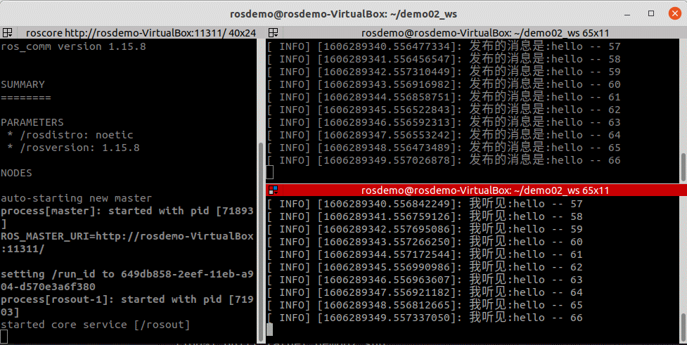
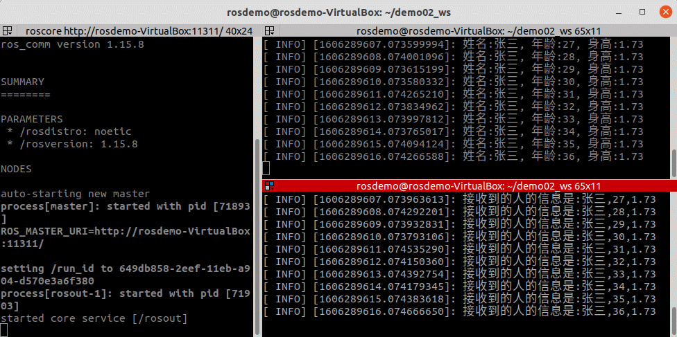
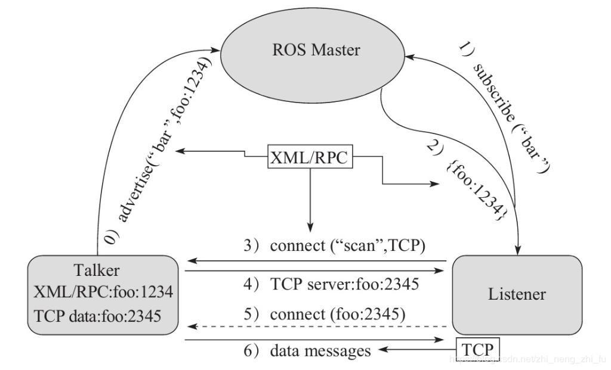
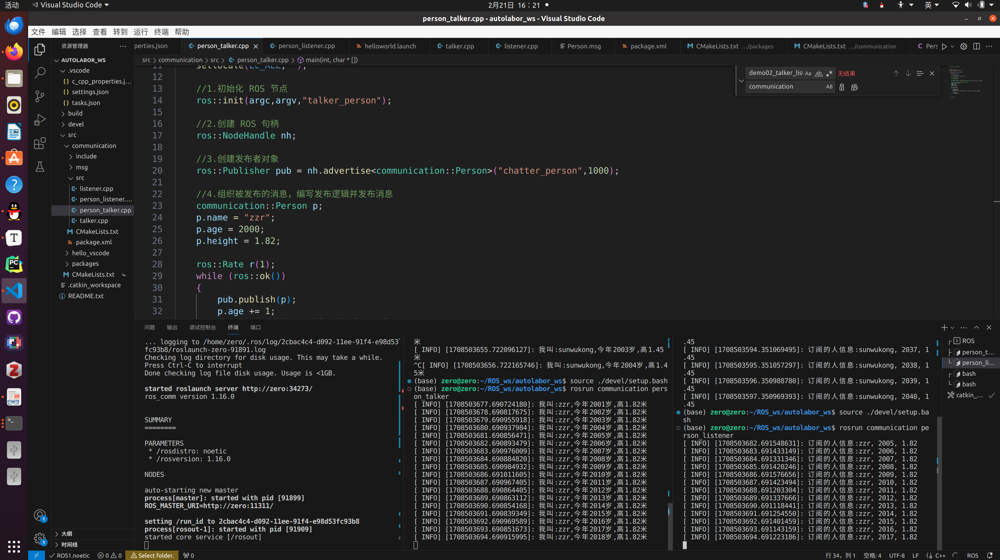

# 

U2 ROS通讯机制

机器人是一种高度复杂的系统性实现，在机器人上可能集成各种传感器(雷达、摄像头、GPS...)以及运动控制实现，为了解耦合，在ROS中每一个功能点都是一个单独的进程，每一个进程都是独立运行的。更确切的讲，**ROS是进程（也称为*****Nodes*****）的分布式框架。** 因为这些进程甚至还可分布于不同主机，不同主机协同工作，从而分散计算压力。

ROS 中的基本通信机制主要有如下三种实现策略:

- 话题通信(发布订阅模式)
- 服务通信(请求响应模式)
- 参数服务器(参数共享模式)

本章的主要内容就是是介绍各个通信机制的应用场景、理论模型、代码实现以及相关操作命令。本章预期达成学习目标如下:

- 能够熟练介绍ROS中常用的通信机制
- 能够理解ROS中每种通信机制的理论模型
- 能够以代码的方式实现各种通信机制对应的案例
- 能够熟练使用ROS中的一些操作命令
- 能够独立完成相关实操案例


## 2.1 话题通讯

#### **概念**

以发布订阅的方式实现不同节点之间数据交互的通信模式。

#### **作用**

用于不断更新的、少逻辑处理的数据传输场景。

#### **案例**

1.实现最基本的发布订阅模型，发布方以固定频率发送一段文本，订阅方接收文本并输出。(2.1.2 -- 2.1.3)



2.实现对自定义消息的发布与订阅。(2.1.4 -- 2.1.6)



### 2.1.1 理论模型

话题通信实现模型是比较复杂的，该模型如下图所示,该模型中涉及到三个角色:

- ROS Master (管理者)
- Talker (发布者)
- Listener (订阅者)

ROS Master 负责保管 Talker 和 Listener 注册的信息，并匹配话题相同的 Talker 与 Listener，帮助 Talker 与 Listener 建立连接，连接建立后，Talker 可以发布消息，且发布的消息会被 Listener 订阅。

整个流程由以下步骤实现:

#### 0.Talker注册

Talker启动后，会通过RPC在 ROS Master 中注册自身信息，其中包含所发布消息的话题名称。ROS Master 会将节点的注册信息加入到注册表中。

#### 1.Listener注册

Listener启动后，也会通过RPC在 ROS Master 中注册自身信息，包含需要订阅消息的话题名。ROS Master 会将节点的注册信息加入到注册表中。

#### 2.ROS Master实现信息匹配

ROS Master 会根据注册表中的信息匹配Talker 和 Listener，并通过 RPC 向 Listener 发送 Talker 的 RPC 地址信息。

#### 3.Listener向Talker发送请求

Listener 根据接收到的 RPC 地址，通过 RPC 向 Talker 发送连接请求，传输订阅的话题名称、消息类型以及通信协议(TCP/UDP)。

#### 4.Talker确认请求

Talker 接收到 Listener 的请求后，也是通过 RPC 向 Listener 确认连接信息，并发送自身的 TCP 地址信息。

#### 5.Listener与Talker件里连接

Listener 根据步骤4 返回的消息使用 TCP 与 Talker 建立网络连接。

#### 6.Talker向Listener发送消息

连接建立后，Talker 开始向 Listener 发布消息。

> 注意1:上述实现流程中，前五步使用的 RPC协议，最后两步使用的是 TCP 协议
>
> 注意2: Talker 与 Listener 的启动无先后顺序要求
>
> 注意3: Talker 与 Listener 都可以有多个
>
> 注意4: Talker 与 Listener 连接建立后，不再需要 ROS Master。也即，即便关闭ROS Master，Talker 与 Listern 照常通信。

------

### 2.1.2 话题通信基本操作A(C++)

**需求:**

> 编写发布订阅实现，要求发布方以10HZ(每秒10次)的频率发布文本消息，订阅方订阅消息并将消息内容打印输出。

**分析:**

在模型实现中，ROS master  不需要实现，而连接的建立也已经被封装了，需要关注的关键点有三个:

1. 发布方
2. 接收方
3. 数据(此处为普通文本)

**流程:**

1. 编写发布方实现；
2. 编写订阅方实现；
3. 编辑配置文件；
4. 编译并执行。


#### 1.talker.cpp

```c++
#include "ros/ros.h"
#include "std_msgs/String.h"
#include<sstream>

int main(int argc, char *argv[])
{
    //设置编码
    setlocale(LC_ALL,"");

    //初始化ROS节点
    ros::init(argc,argv,"talker");

    ros::NodeHandle nh;

    //发布者
     //泛型: 发布的消息类型
    //参数1: 要发布到的话题
    //参数2: 队列中最大保存的消息数，超出此阀值时，先进的先销毁(时间早的先销毁)
    ros::Publisher pub = nh.advertise<std_msgs::String>("chatter",10);

    //组织被发布数据
    std_msgs::String msg;
    std::string msg_front = "Hello"; //消息前缀
    int count = 0;

    ros::Rate r(1);

    while(ros::ok()) //节点不死
    {
        //使用string stream 拼接字符串与编号
        std::stringstream ss;
        ss << msg_front << count;
        msg.data = ss.str();

        //发布消息
        pub.publish(msg);
        //调试
        ROS_INFO("发送的消息：%s",msg.data.c_str());

        r.sleep();
        count++;
        ros::spinOnce;
    }
    return 0;
}
```


#### 2. listener.cpp

```c++

#include "ros/ros.h"
#include "std_msgs/String.h"

void doMsg(const std_msgs::String::ConstPtr& msg_p)
{
    ROS_INFO("I heard : %s",msg_p->data.c_str());
}

int main(int argc,char *argv[])
{
    //设置编码 （？）
    setlocale(LC_ALL,"");

    ros::init(argc,argv,"listener");

    ros::NodeHandle nh;

    //实例化 订阅者 对象
    ros::Subscriber sub = nh.subscribe<std_msgs::String>("chatter",10,doMsg);

    ros::spin();
    
    return 0;
}
```

#### 3.配置 CMakeLists.txt

```cmake
add_executable(Hello_pub
  src/Hello_pub.cpp
)
add_executable(Hello_sub
  src/Hello_sub.cpp
)

target_link_libraries(Hello_pub
  ${catkin_LIBRARIES}
)
target_link_libraries(Hello_sub
  ${catkin_LIBRARIES}
)
```


### 2.1.4 话题通信自定义msg

在 ROS 通信协议中，数据载体是一个较为重要组成部分，ROS 中通过 std_msgs  封装了一些原生的数据类型,比如:String、Int32、Int64、Char、Bool、Empty.... 但是，这些数据一般只包含一个  data 字段，结构的单一意味着功能上的局限性，当传输一些复杂的数据，比如: 激光雷达的信息... std_msgs  由于描述性较差而显得力不从心，这种场景下可以使用自定义的消息类型

msgs只是简单的文本文件，每行具有字段类型和字段名称，可以使用的字段类型有：

- int8, int16, int32, int64 (或者无符号类型: uint*)
- float32, float64
- string
- time, duration
- other msg files
- variable-length array[] and fixed-length array[C]

ROS中还有一种特殊类型：`Header`，标头包含时间戳和ROS中常用的坐标帧信息。会经常看到msg文件的第一行具有`Header标头`。**需求:**创建自定义消息，该消息包含人的信息:姓名、身高、年龄等。

**流程:**

1. 按照固定格式创建 msg 文件

2. 编辑配置文件

3. 编译生成可以被 Python 或 C++ 调用的中间文件

   

   