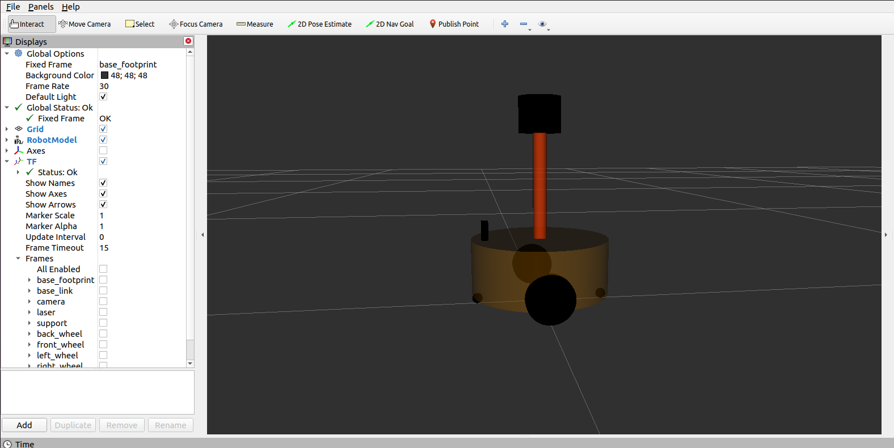
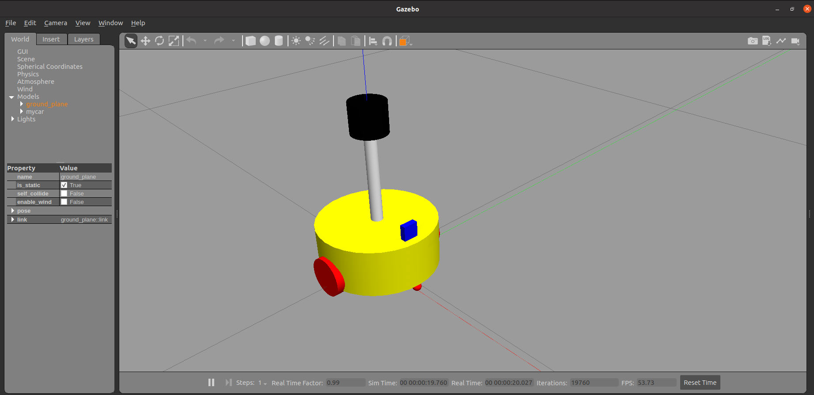
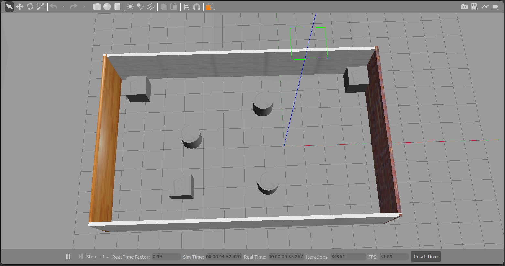
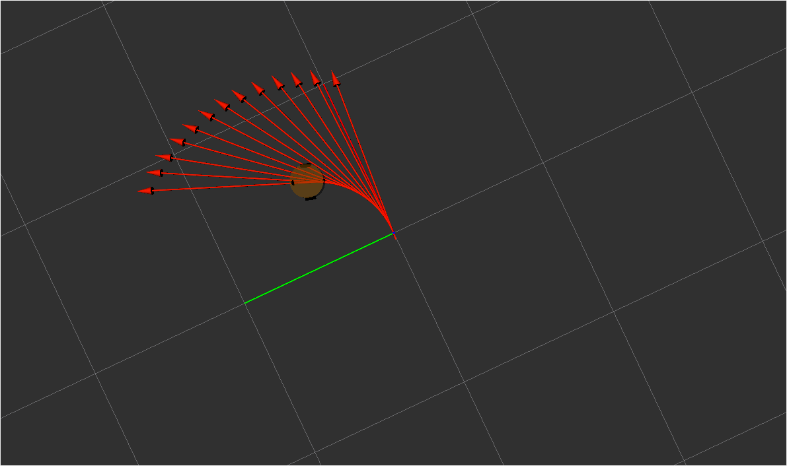
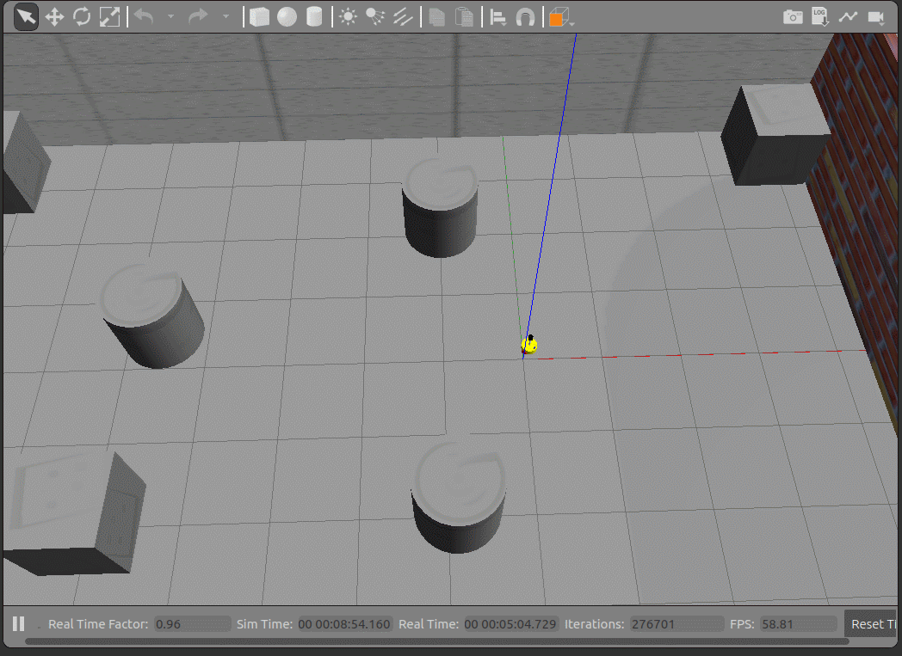
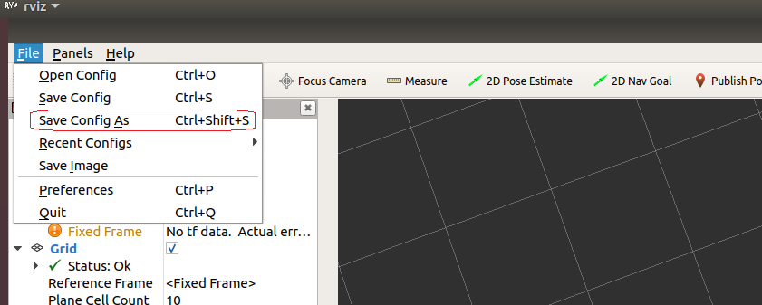

# 第 6 章 机器人系统仿真

对于ROS新手而言，可能会有疑问:学习机器人操作系统，实体机器人是必须的吗？答案是否定的，机器人一般价格不菲，为了降低机器人学习、调试成本，在ROS中提供了系统的机器人仿真实现，通过仿真，可以实现大部分需求，本章主要就是围绕“仿真”展开的，比如，本章会介绍:

- 如何创建并显示机器人模型；
- 如何搭建仿真环境；
- 如何实现机器人模型与仿真环境的交互。

本章预期的学习目标如下:

- 能够独立使用URDF创建机器人模型，并在Rviz和Gazebo中分别显示；
- 能够使用Gazebo搭建仿真环境；
- 能够使用机器人模型中的传感器(雷达、摄像头、编码器...)获取仿真环境数据。

案例演示:

1.创建并显示机器人模型

2.仿真环境搭建

3.控制机器人运动

4.雷达仿真


5.摄像头仿真


## 6.1 概述

机器人操作系统学习、开发与测试过程中，会遇到诸多问题，比如:

> 场景1:机器人一般价格不菲，学习ROS要购买一台机器人吗？
>
> 场景2:机器人与之交互的外界环境具有多样性，如何实现复杂的环境设计？
>
> 场景3:测试时，直接将未经验证的程序部署到实体机器人运行，安全吗？
>
> ...

在诸如此类的场景中，ROS中的**仿真**就显得尤为重要了。

------

#### 1.**概念**

**机器人系统仿真：**是通过计算机对实体机器人系统进行模拟的技术，在 ROS 中，仿真实现涉及的内容主要有三:对机器人建模(URDF)、创建仿真环境(Gazebo)以及感知环境(Rviz)等系统性实现。

#### 2.**作用**

##### 2.1仿真优势:

仿真在机器人系统研发过程中占有举足轻重的地位，在研发与测试中较之于实体机器人实现，仿真有如下几点的显著优势:

1.**低成本:**当前机器人成本居高不下，动辄几十万，仿真可以大大降低成本，减小风险

2.**高效:**搭建的环境更为多样且灵活，可以提高测试效率以及测试覆盖率

3.**高安全性:**仿真环境下，无需考虑耗损问题

##### 2.2仿真缺陷:

机器人在仿真环境与实际环境下的表现差异较大，换言之，仿真并不能完全做到模拟真实的物理世界，存在一些"失真"的情况，原因:

1.仿真器所使用的物理引擎目前还不能够完全精确模拟真实世界的物理情况

2.仿真器构建的是关节驱动器（电机&齿轮箱）、传感器与信号通信的绝对理想情况，目前不支持模拟实际硬件缺陷或者一些临界状态等情形

#### 3.相关组件

##### 3.1URDF

**URDF**是 Unified Robot Description Format 的首字母缩写，直译为**统一(标准化)机器人描述格式**，可以以一种 XML 的方式描述机器人的部分结构，比如底盘、摄像头、激光雷达、机械臂以及不同关节的自由度.....,该文件可以被 C++ 内置的解释器转换成可视化的机器人模型，是 ROS 中实现机器人仿真的重要组件

##### 3.2rviz

RViz 是 ROS Visualization Tool 的首字母缩写，直译为**ROS的三维可视化工具**。它的主要目的是以三维方式显示ROS消息，可以将 数据进行可视化表达。例如:可以显示机器人模型，可以无需编程就能表达激光测距仪（LRF）传感器中的传感  器到障碍物的距离，RealSense、Kinect或Xtion等三维距离传感器的点云数据（PCD， Point Cloud  Data），从相机获取的图像值等

以“ros- [ROS_DISTRO] -desktop-full”命令安装ROS时，RViz会默认被安装。

运行使用命令`rviz`或`rosrun rviz rviz`

***如果rviz没有安装，请调用如下命令自行安装:***

```
sudo apt install ros-[ROS_DISTRO]-rviz
```

##### 3.3gazebo

Gazebo是一款3D动态模拟器，用于显示机器人模型并创建仿真环境,能够在复杂的室内和室外环境中准确有效地模拟机器人。与游戏引擎提供高保真度的视觉模拟类似，Gazebo提供高保真度的物理模拟，其提供一整套传感器模型，以及对用户和程序非常友好的交互方式。

以“ros- [ROS_DISTRO] -desktop-full”命令安装ROS时，gzebo会默认被安装。

运行使用命令`gazebo`或`rosrun gazebo_ros gazebo`

**注意1:*****在 Ubuntu20.04 与 ROS Noetic 环境下，gazebo 启动异常以及解决***

- **问题1:**VMware: vmw_ioctl_command error Invalid argument(无效的参数)

  **解决:**

  `echo "export SVGA_VGPU10=0" >> ~/.bashrc`

  `source .bashrc`

- **问题2:**[Err] [REST.cc:205] Error in REST request

  **解决:**`sudo gedit ~/.ignition/fuel/config.yaml`

  然后将`url : https://api.ignitionfuel.org`使用 # 注释

  再添加`url: https://api.ignitionrobotics.org`

- **问题3:**启动时抛出异常:`[gazebo-2] process has died [pid xxx, exit code 255, cmd.....`

  **解决:**`killall gzserver`和`killall gzclient`

**注意2:*****如果 gazebo没有安装，请自行安装:***

1.添加源:

```
sudo sh -c 'echo "deb http://packages.osrfoundation.org/gazebo/ubuntu-stable `lsb_release -cs` main" 
>
 /etc/apt/sources.list.d/gazebo-stable.list'
wget http://packages.osrfoundation.org/gazebo.key -O - | sudo apt-key add -
```

2.安装：

```
sudo apt update
sudo apt install gazebo11 
sudo apt install libgazebo11-dev
```

------

**另请参考:**

- https://wiki.ros.org/urdf
- http://wiki.ros.org/rviz
- http://gazebosim.org/tutorials?tut=ros_overview

**课程说明:**

机器人的系统仿真是一种集成实现，主要包含三部分:

- URDF 用于创建机器人模型
- Gzebo 用于搭建仿真环境
- Rviz 图形化的显示机器人各种传感器感知到的环境信息

三者应用中，只是创建 URDF 意义不大，一般需要结合 Gazebo 或 Rviz 使用，在 Gazebo 或 Rviz 中可以将 URDF 文件解析为图形化的机器人模型，一般的使用组合为:

- 如果非仿真环境，那么使用 URDF 结合 Rviz 直接显示感知的真实环境信息
- 如果是仿真环境，那么需要使用 URDF 结合 Gazebo 搭建仿真环境，并结合 Rviz 显示感知的虚拟环境信息

后续课程安排:

- 先介绍 URDF 与 Rviz 集成使用，在 Rviz 中只是显示机器人模型，主要用于学习 URDF 语法
- 再介绍 URDF 与 Gazebo 集成，主要学习 URDF 仿真相关语法以及仿真环境搭建
- 最后集成 URDF 与 Gazebo 与 Rviz，实现综合应用

素材链接:

- https://github.com/zx595306686/sim_demo.git


## 6.2 URDF集成Rviz基本流程

前面介绍过，URDF 不能单独使用，需要结合 Rviz 或 Gazebo，URDF 只是一个文件，需要在 Rviz 或 Gazebo  中渲染成图形化的机器人模型，当前，首先演示URDF与Rviz的集成使用，因为URDF与Rviz的集成较之于URDF与Gazebo的集成更为简单，后期，基于Rviz的集成实现，我们再进一步介绍URDF语法。

**需求描述:**

在 Rviz 中显示一个盒状机器人

**结果演示:**

**实现流程：**

1. 准备:新建功能包，导入依赖
2. 核心:编写 urdf 文件
3. 核心:在 launch 文件集成 URDF 与 Rviz
4. 在 Rviz 中显示机器人模型

#### 1.创建功能包，导入依赖

创建一个新的功能包，名称自定义，导入依赖包:`urdf`与`xacro`

在当前功能包下，再新建几个目录:

`urdf`: 存储 urdf 文件的目录

`meshes`:机器人模型渲染文件(暂不使用)

`config`: 配置文件

`launch`: 存储 launch 启动文件

#### 2.编写 URDF 文件

新建一个子级文件夹:`urdf`(可选)，文件夹中添加一个`.urdf`文件,复制如下内容:

```xml
<robot name="mycar">
    <link name="base_link">
        <visual>
            <geometry>
                <box size="0.5 0.2 0.1" />
            </geometry>
        </visual>
    </link>
</robot>
```

#### 3.在 launch 文件中集成 URDF 与 Rviz

在`launch`目录下，新建一个 launch 文件，该 launch 文件需要启动 Rviz，并导入 urdf 文件，Rviz 启动后可以自动载入解析`urdf`文件，并显示机器人模型，核心问题:如何导入 urdf 文件? 在 ROS 中，可以将 urdf 文件的路径设置到参数服务器，使用的参数名是:`robot_description`,示例代码如下:

```xml
<launch>

    <!-- 设置参数 -->
    <param name="robot_description" textfile="$(find 包名)/urdf/urdf/urdf01_HelloWorld.urdf" />

    <!-- 启动 rviz -->
    <node pkg="rviz" type="rviz" name="rviz" />

</launch>
```

#### 4.在 Rviz 中显示机器人模型

rviz 启动后，会发现并没有盒装的机器人模型，这是因为默认情况下没有添加机器人显示组件，需要手动添加，添加方式如下:设置完毕后，可以正常显示了

#### 5.优化 rviz 启动

重复启动`launch`文件时，Rviz 之前的组件配置信息不会自动保存，需要重复执行步骤4的操作，为了方便使用，可以使用如下方式优化:

首先，将当前配置保存进`config`目录然后，`launch`文件中 Rviz 的启动配置添加参数:`args`,值设置为`-d 配置文件路径`

```xml
<launch>
    <param name="robot_description" textfile="$(find 包名)/urdf/urdf/urdf01_HelloWorld.urdf" />
    <node pkg="rviz" type="rviz" name="rviz" args="-d $(find 报名)/config/rviz/show_mycar.rviz" />
</launch>
```

再启动时，就可以包含之前的组件配置了，使用更方便快捷。

## 6.3 URDF语法详解

URDF 文件是一个标准的 XML 文件，在 ROS 中预定义了一系列的标签用于描述机器人模型，机器人模型可能较为复杂，但是 ROS 的  URDF 中机器人的组成却是较为简单，可以主要简化为两部分:连杆(link标签) 与 关节(joint标签)，接下来我们就通过案例了解一下  URDF 中的不同标签:

- robot 根标签，类似于 launch文件中的launch标签
- link 连杆标签
- joint 关节标签
- gazebo 集成gazebo需要使用的标签

关于gazebo标签，后期在使用 gazebo 仿真时，才需要使用到，用于配置仿真环境所需参数，比如: 机器人材料属性、gazebo插件等，但是该标签不是机器人模型必须的，只有在仿真时才需设置

### 6.3.1 URDF语法详解01_robot

#### robot

urdf 中为了保证 xml 语法的完整性，使用了`robot`标签作为根标签，所有的 link 和 joint 以及其他标签都必须包含在 robot 标签内,在该标签内可以通过 name 属性设置机器人模型的名称

#### 1.属性

name: 指定机器人模型的名称

#### 2.子标签

其他标签都是子级标签

### 6.3.2 URDF语法详解02_link

#### link

urdf 中的 link 标签用于描述机器人某个部件(也即刚体部分)的外观和物理属性，比如: 机器人底座、轮子、激光雷达、摄像头...每一个部件都对应一个 link, 在 link 标签内，可以设计该部件的形状、尺寸、颜色、惯性矩阵、碰撞参数等一系列属性

#### 1.属性

- name ---> 为连杆命名

#### 2.子标签

- visual ---> 描述外观(对应的数据是可视的)
  - geometry 设置连杆的形状
    - 标签1: box(盒状)
      - 属性:size=长(x) 宽(y) 高(z)
    - 标签2: cylinder(圆柱)
      - 属性:radius=半径 length=高度
    - 标签3: sphere(球体)
      - 属性:radius=半径
    - 标签4: mesh(为连杆添加皮肤)
      - 属性: filename=资源路径(格式:**package://<packagename>/<path>/文件**)
  - origin 设置偏移量与倾斜弧度
    - 属性1: xyz=x偏移 y便宜 z偏移
    - 属性2: rpy=x翻滚 y俯仰 z偏航 (单位是弧度)
  - metrial 设置材料属性(颜色)
    - 属性: name
    - 标签: color
      - 属性: rgba=红绿蓝权重值与透明度 (每个权重值以及透明度取值[0,1])
- collision ---> 连杆的碰撞属性
- Inertial ---> 连杆的惯性矩阵

在此，只演示`visual`使用。

#### 3.案例

**需求:**分别生成长方体、圆柱与球体的机器人部件

```xml
    <link name="base_link">
        <visual>
            <!-- 形状 -->
            <geometry>
                <!-- 长方体的长宽高 -->
                <!-- <box size="0.5 0.3 0.1" /> -->
                <!-- 圆柱，半径和长度 -->
                <!-- <cylinder radius="0.5" length="0.1" /> -->
                <!-- 球体，半径-->
                <!-- <sphere radius="0.3" /> -->

            </geometry>
            <!-- xyz坐标 rpy翻滚俯仰与偏航角度(3.14=180度 1.57=90度) -->
            <origin xyz="0 0 0" rpy="0 0 0" />
            <!-- 颜色: r=red g=green b=blue a=alpha -->
            <material name="black">
                <color rgba="0.7 0.5 0 0.5" />
            </material>
        </visual>
    </link>
```

### 6.3.3 URDF语法详解03_joint

#### joint

urdf 中的 joint 标签用于描述机器人关节的运动学和动力学属性，还可以指定关节运动的安全极限，机器人的两个部件(分别称之为  parent link 与 child link)以"关节"的形式相连接，不同的关节有不同的运动形式:  旋转、滑动、固定、旋转速度、旋转角度限制....,比如:安装在底座上的轮子可以360度旋转，而摄像头则可能是完全固定在底座上。

joint标签对应的数据在模型中是不可见的

#### 1.属性

- name ---> 为关节命名
- type ---> 关节运动形式
  - continuous: 旋转关节，可以绕单轴无限旋转
  - revolute: 旋转关节，类似于 continues,但是有旋转角度限制
  - prismatic: 滑动关节，沿某一轴线移动的关节，有位置极限
  - planer: 平面关节，允许在平面正交方向上平移或旋转
  - floating: 浮动关节，允许进行平移、旋转运动
  - fixed: 固定关节，不允许运动的特殊关节

#### 2.子标签

- parent(必需的)

  parent link的名字是一个强制的属性：

  - link:父级连杆的名字，是这个link在机器人结构树中的名字。

- child(必需的)

  child link的名字是一个强制的属性：

  - link:子级连杆的名字，是这个link在机器人结构树中的名字。

- origin

  - 属性: xyz=各轴线上的偏移量 rpy=各轴线上的偏移弧度。

- axis

  - 属性: xyz用于设置围绕哪个关节轴运动。

#### 3.案例

**需求:**创建机器人模型，底盘为长方体，在长方体的前面添加一摄像头，摄像头可以沿着 Z 轴 360 度旋转。

**URDF文件示例如下:**

```xml
<!-- 
    需求: 创建机器人模型，底盘为长方体，
         在长方体的前面添加一摄像头，
         摄像头可以沿着 Z 轴 360 度旋转

 -->
<robot name="mycar">
    <!-- 底盘 -->
    <link name="base_link">
        <visual>
            <geometry>
                <box size="0.5 0.2 0.1" />
            </geometry>
            <origin xyz="0 0 0" rpy="0 0 0" />
            <material name="blue">
                <color rgba="0 0 1.0 0.5" />
            </material>
        </visual>
    </link>

    <!-- 摄像头 -->
    <link name="camera">
        <visual>
            <geometry>
                <box size="0.02 0.05 0.05" />
            </geometry>
            <origin xyz="0 0 0" rpy="0 0 0" />
            <material name="red">
                <color rgba="1 0 0 0.5" />
            </material>
        </visual>
    </link>

    <!-- 关节 -->
    <joint name="camera2baselink" type="continuous">
        <parent link="base_link"/>
        <child link="camera" />
        <!-- 需要计算两个 link 的物理中心之间的偏移量 -->
        <origin xyz="0.2 0 0.075" rpy="0 0 0" />
        <axis xyz="0 0 1" />
    </joint>

</robot>
```

**launch文件示例如下:**

```xml
<launch>

    <param name="robot_description" textfile="$(find urdf_rviz_demo)/urdf/urdf/urdf03_joint.urdf" />
    <node pkg="rviz" type="rviz" name="rviz" args="-d $(find urdf_rviz_demo)/config/helloworld.rviz" /> 

    <!-- 添加关节状态发布节点 -->
    <node pkg="joint_state_publisher" type="joint_state_publisher" name="joint_state_publisher" />
    <!-- 添加机器人状态发布节点 -->
    <node pkg="robot_state_publisher" type="robot_state_publisher" name="robot_state_publisher" />
    <!-- 可选:用于控制关节运动的节点 -->
    <node pkg="joint_state_publisher_gui" type="joint_state_publisher_gui" name="joint_state_publisher_gui" />

</launch>
```

PS:

1.状态发布节点在此是必须的:

```xml
    <!-- 添加关节状态发布节点 -->
    <node pkg="joint_state_publisher" type="joint_state_publisher" name="joint_state_publisher" />
    <!-- 添加机器人状态发布节点 -->
    <node pkg="robot_state_publisher" type="robot_state_publisher" name="robot_state_publisher" />
```

2.关节运动控制节点(可选)，会生成关节控制的UI，用于测试关节运动是否正常。

```xml
    <!-- 可选:用于控制关节运动的节点 -->
    <node pkg="joint_state_publisher_gui" type="joint_state_publisher_gui" name="joint_state_publisher_gui" />
```

#### 4.base_footprint优化urdf

前面实现的机器人模型是半沉到地下的，因为默认情况下: 底盘的中心点位于地图原点上，所以会导致这种情况产生，可以使用的优化策略，将初始  link 设置为一个尺寸极小的 link(比如半径为 0.001m 的球体，或边长为 0.001m 的立方体)，然后再在初始 link  上添加底盘等刚体，这样实现，虽然仍然存在初始link半沉的现象，但是基本可以忽略了。这个初始 link 一般称之为 base_footprint

```xml
<!--

    使用 base_footprint 优化

-->
<robot name="mycar">
    <!-- 设置一个原点(机器人中心点的投影) -->
    <link name="base_footprint">
        <visual>
            <geometry>
                <sphere radius="0.001" />
            </geometry>
        </visual>
    </link>

    <!-- 添加底盘 -->
    <link name="base_link">
        <visual>
            <geometry>
                <box size="0.5 0.2 0.1" />
            </geometry>
            <origin xyz="0 0 0" rpy="0 0 0" />
            <material name="blue">
                <color rgba="0 0 1.0 0.5" />
            </material>
        </visual>
    </link>

    <!-- 底盘与原点连接的关节 -->
    <joint name="base_link2base_footprint" type="fixed">
        <parent link="base_footprint" />
        <child link="base_link" />
        <origin xyz="0 0 0.05" />
    </joint>

    <!-- 添加摄像头 -->
    <link name="camera">
        <visual>
            <geometry>
                <box size="0.02 0.05 0.05" />
            </geometry>
            <origin xyz="0 0 0" rpy="0 0 0" />
            <material name="red">
                <color rgba="1 0 0 0.5" />
            </material>
        </visual>
    </link>
    <!-- 关节 -->
    <joint name="camera2baselink" type="continuous">
        <parent link="base_link"/>
        <child link="camera" />
        <origin xyz="0.2 0 0.075" rpy="0 0 0" />
        <axis xyz="0 0 1" />
    </joint>

</robot>
```

launch 文件内容不变。

#### 5.遇到问题以及解决

**问题1:**

命令行输出如下错误提示

```
UnicodeEncodeError: 'ascii' codec can't encode characters in position 463-464: ordinal not in range(128)
[joint_state_publisher-3] process has died [pid 4443, exit code 1, cmd /opt/ros/melodic/lib/joint_state_publisher/joint_state_publisher __name:=joint_state_publisher __log:=/home/rosmelodic/.ros/log/b38967c0-0acb-11eb-aee3-0800278ee10c/joint_state_publisher-3.log].
log file: /home/rosmelodic/.ros/log/b38967c0-0acb-11eb-aee3-0800278ee10c/joint_state_publisher-3*.log
```

rviz中提示坐标变换异常，导致机器人部件显示结构异常

**原因:**编码问题导致的

**解决:**去除URDF中的中文注释

**问题2:**[ERROR] [1584370263.037038]: Could not find the GUI, install the 'joint_state_publisher_gui' package

**解决:**`sudo apt install ros-noetic-joint-state-publisher-gui`


## 6.4 URDF优化_xacro

前面 URDF 文件构建机器人模型的过程中，存在若干问题。

> 问题1:在设计关节的位置时，需要按照一定的公式计算，公式是固定的，但是在 URDF 中依赖于人工计算，存在不便，容易计算失误，且当某些参数发生改变时，还需要重新计算。
>
> 问题2:URDF 中的部分内容是高度重复的，驱动轮与支撑轮的设计实现，不同轮子只是部分参数不同，形状、颜色、翻转量都是一致的，在实际应用中，构建复杂的机器人模型时，更是易于出现高度重复的设计，按照一般的编程涉及到重复代码应该考虑封装。
>
> ......

如果在编程语言中，可以通过变量结合函数直接解决上述问题，在 ROS 中，已经给出了类似编程的优化方案，称之为:**Xacro**

------

#### **概念**

Xacro 是 XML Macros 的缩写，Xacro 是一种 XML 宏语言，是可编程的 XML。

#### **原理**

Xacro 可以声明变量，可以通过数学运算求解，使用流程控制控制执行顺序，还可以通过类似函数的实现，封装固定的逻辑，将逻辑中需要的可变的数据以参数的方式暴露出去，从而提高代码复用率以及程序的安全性。

#### **作用**

较之于纯粹的 URDF 实现，可以编写更安全、精简、易读性更强的机器人模型文件，且可以提高编写效率。

------

**另请参考:**

- http://wiki.ros.org/xacro

### 6.4.2 Xacro_语法详解

xacro 提供了可编程接口，类似于计算机语言，包括变量声明调用、函数声明与调用等语法实现。在使用 xacro 生成 urdf 时，根标签`robot`中必须包含命名空间声明:`xmlns:xacro="http://wiki.ros.org/xacro"`

#### 1.属性与算数运算

用于封装 URDF 中的一些字段，比如: PAI 值，小车的尺寸，轮子半径 ....

**属性定义**

```xml
<xacro:property name="xxxx" value="yyyy" />
```

**属性调用**

```
${属性名称}
```

**算数运算**

```
${数学表达式}
```

#### 2.宏

类似于函数实现，提高代码复用率，优化代码结构，提高安全性

**宏定义**

```xml
<xacro:macro name="宏名称" params="参数列表(多参数之间使用空格分隔)">

    .....

    参数调用格式: ${参数名}

</xacro:macro>
```

**宏调用**

```xml
<xacro:宏名称 参数1=xxx 参数2=xxx/>
```

#### 3.文件包含

机器人由多部件组成，不同部件可能封装为单独的 xacro 文件，最后再将不同的文件集成，组合为完整机器人，可以使用文件包含实现

**文件包含**

```xml
<robot name="xxx" xmlns:xacro="http://wiki.ros.org/xacro">
      <xacro:include filename="my_base.xacro" />
      <xacro:include filename="my_camera.xacro" />
      <xacro:include filename="my_laser.xacro" />
      ....
</robot>
```