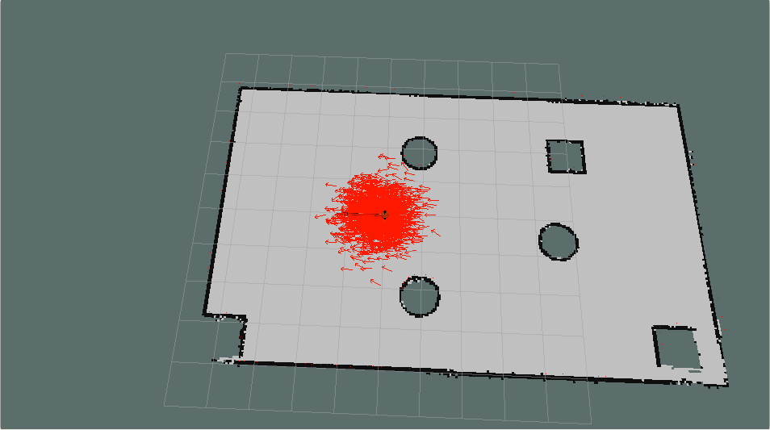
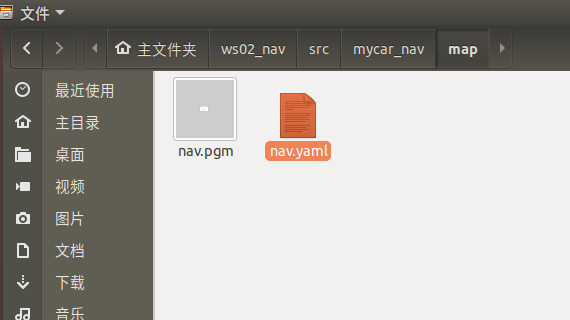
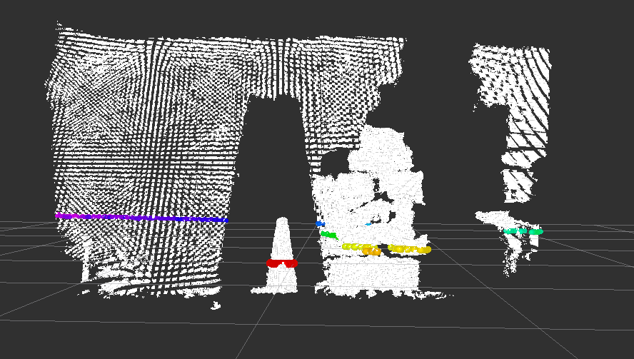

# 第 7 章 机器人导航(仿真)

导航是机器人系统中最重要的模块之一，比如现在较为流行的服务型室内机器人，就是依赖于机器人导航来实现室内自主移动的，本章主要就是介绍仿真环境下的导航实现，主要内容有:

- 导航相关概念
- 导航实现:机器人建图(SLAM)、地图服务、定位、路径规划....以可视化操作为主。
- 导航消息:了解地图、里程计、雷达、摄像头等相关消息格式。

预期达成的学习目标:

- 了解导航模块中的组成部分以及相关概念
- 能够在仿真环境下独立完成机器人导航

**案例演示:**

SLAM建图


定位



导航实现


## 7.1 概述

#### 1.概念

在ROS中机器人导航(Navigation)由多个功能包组合实现，ROS 中又称之为导航功能包集，关于导航模块，官方介绍如下:

```
一个二维导航堆栈，它接收来自里程计、传感器流和目标姿态的信息，并输出发送到移动底盘的安全速度命令。
```

更通俗的讲: 导航其实就是机器人自主的从 A 点移动到 B 点的过程。


#### 2.作用

秉着"不重复发明轮子"的原则，ROS 中导航相关的功能包集为机器人导航提供了一套通用的实现，开发者不再需要关注于导航算法、硬件交互...  等偏复杂、偏底层的实现，这些实现都由更专业的研发人员管理、迭代和维护，开发者可以更专注于上层功能，而对于导航功能的调用，只需要根据自身机器人相关参数合理设置各模块的配置文件即可，当然，如果有必要，也可以基于现有的功能包二次开发实现一些定制化需求，这样可以大大提高研发效率，缩短产品落地时间。总而言之，对于一般开发者而言，ROS 的导航功能包集优势如下:

- 安全: 由专业团队开发和维护
- 功能: 功能更稳定且全面
- 高效: 解放开发者，让开发者更专注于上层功能实现

------

**另请参考:**

- http://wiki.ros.org/navigation


### 7.1.1导航模块简介

机器人是如何实现导航的呢？或换言之，机器人是如何从 A 点移动到 B 点呢？ROS 官方为了提供了一张导航功能包集的图示,该图中囊括了 ROS 导航的一些关键技术:

假定我们已经以特定方式配置机器人，导航功能包集将使其可以运动。上图概述了这种配置方式。白色的部分是必须且已实现的组件，灰色的部分是可选且已实现的组件，蓝色的部分是必须为每一个机器人平台创建的组件。

总结下来，涉及的关键技术有如下五点:

1. 全局地图
2. 自身定位
3. 路径规划
4. 运动控制
5. 环境感知

机器人导航实现与无人驾驶类似，关键技术也是由上述五点组成，只是无人驾驶是基于室外的，而我们当前介绍的机器人导航更多是基于室内的。

#### 1.全局地图

在现实生活中，当我们需要实现导航时，可能会首先参考一张全局性质的地图，然后根据地图来确定自身的位置、目的地位置，并且也会根据地图显示来规划一条大致的路线....  对于机器人导航而言，也是如此，在机器人导航中地图是一个重要的组成元素，当然如果要使用地图，首先需要绘制地图。关于地图建模技术不断涌现，这其中有一门称之为 SLAM 的理论脱颖而出:

1. **SLAM**(simultaneous localization and  mapping),也称为CML (Concurrent Mapping and Localization),  即时定位与地图构建，或并发建图与定位。SLAM问题可以描述为:  机器人在未知环境中从一个未知位置开始移动,在移动过程中根据位置估计和地图进行自身定位，同时在自身定位的基础上建造增量式地图，以绘制出外部环境的完全地图。
2. 在 ROS 中，较为常用的 SLAM 实现也比较多，比如: gmapping、hector_slam、cartographer、rgbdslam、ORB_SLAM ....
3. 当然如果要完成 SLAM ，机器人必须要具备感知外界环境的能力，尤其是要具备获取周围环境深度信息的能力。感知的实现需要依赖于传感器，比如: 激光雷达、摄像头、RGB-D摄像头...
4. SLAM 可以用于地图生成，而生成的地图还需要被保存以待后续使用，在 ROS 中保存地图的功能包是 map_server

另外注意: SLAM 虽然是机器人导航的重要技术之一，但是 二者并不等价，确切的讲，SLAM 只是实现地图构建和即时定位。

#### 2.自身定位

导航伊始和导航过程中，机器人都需要确定当前自身的位置，如果在室外，那么 GPS 是一个不错的选择，而如果室内、隧道、地下或一些特殊的屏蔽  GPS 信号的区域，由于 GPS 信号弱化甚至完全不可用，那么就必须另辟蹊径了，比如前面的 SLAM 就可以实现自身定位，除此之外，ROS  中还提供了一个用于定位的功能包: amcl

**amcl**(adaptiveMonteCarloLocalization)自适应的蒙特卡洛定位,是用于2D移动机器人的概率定位系统。它实现了自适应（或KLD采样）蒙特卡洛定位方法，该方法使用粒子过滤器根据已知地图跟踪机器人的姿态。

#### 3.路径规划

导航就是机器人从A点运动至B点的过程，在这一过程中，机器人需要根据目标位置计算全局运动路线，并且在运动过程中，还需要时时根据出现的一些动态障碍物调整运动路线，直至到达目标点，该过程就称之为路径规划。在 ROS 中提供了 move_base 包来实现路径规则,该功能包主要由两大规划器组成:

1. 全局路径规划(gloable_planner)

   根据给定的目标点和全局地图实现总体的路径规划，使用 Dijkstra 或 A* 算法进行全局路径规划，计算最优路线，作为全局路线

2. 本地时时规划(local_planner)

   在实际导航过程中，机器人可能无法按照给定的全局最优路线运行，比如:机器人在运行中，可能会随时出现一定的障碍物...  本地规划的作用就是使用一定算法(Dynamic Window Approaches)  来实现障碍物的规避，并选取当前最优路径以尽量符合全局最优路径

全局路径规划与本地路径规划是相对的，全局路径规划侧重于全局、宏观实现，而本地路径规划侧重与当前、微观实现。

#### 4.运动控制

导航功能包集假定它可以通过话题"cmd_vel"发布`geometry_msgs/Twist`类型的消息，这个消息基于机器人的基座坐标系，它传递的是运动命令。这意味着必须有一个节点订阅"cmd_vel"话题， 将该话题上的速度命令转换为电机命令并发送。

#### 5.环境感知

感知周围环境信息，比如: 摄像头、激光雷达、编码器...，摄像头、激光雷达可以用于感知外界环境的深度信息，编码器可以感知电机的转速信息，进而可以获取速度信息并生成里程计信息。

在导航功能包集中，环境感知也是一重要模块实现，它为其他模块提供了支持。其他模块诸如: SLAM、amcl、move_base 都需要依赖于环境感知。

### 7.1.2 导航之坐标系

#### 1.简介

定位是导航中的重要实现之一，所谓定位，就是参考某个坐标系(比如:以机器人的出发点为原点创建坐标系)在该坐标系中标注机器人。定位原理看似简单，但是这个这个坐标系不是客观存在的，我们也无法以上帝视角确定机器人的位姿，定位实现需要依赖于机器人自身，机器人需要逆向推导参考系原点并计算坐标系相对关系，该过程实现常用方式有两种:

- 通过里程计定位:时时收集机器人的速度信息计算并发布机器人坐标系与父级参考系的相对关系。
- 通过传感器定位:通过传感器收集外界环境信息通过匹配计算并发布机器人坐标系与父级参考系的相对关系。

两种方式在导航中都会经常使用。

#### 2.特点

两种定位方式都有各自的优缺点。

里程计定位:

- 优点:里程计定位信息是连续的，没有离散的跳跃。
- 缺点:里程计存在累计误差，不利于长距离或长期定位。

传感器定位:

- 优点:比里程计定位更精准；
- 缺点:传感器定位会出现跳变的情况，且传感器定位在标志物较少的环境下，其定位精度会大打折扣。

两种定位方式优缺点互补，应用时一般二者结合使用。

#### 3.坐标系变换

上述两种定位实现中，机器人坐标系一般使用机器人模型中的根坐标系(base_link 或  base_footprint)，里程计定位时，父级坐标系一般称之为 odom，如果通过传感器定位，父级参考系一般称之为  map。当二者结合使用时，map 和 odom  都是机器人模型根坐标系的父级，这是不符合坐标变换中"单继承"的原则的，所以，一般会将转换关系设置为: map -> doom ->  base_link 或 base_footprint。

### 7.1.3导航条件说明

导航实现，在硬件和软件方面是由一定要求的，需要提前准备。

#### 1.硬件

虽然导航功能包集被设计成尽可能的通用，在使用时仍然有三个主要的硬件限制：

1. 它是为差速驱动的轮式机器人设计的。它假设底盘受到理想的运动命令的控制并可实现预期的结果，命令的格式为：x速度分量，y速度分量，角速度(theta)分量。
2. 它需要在底盘上安装一个单线激光雷达。这个激光雷达用于构建地图和定位。
3. 导航功能包集是为正方形的机器人开发的，所以方形或圆形的机器人将是性能最好的。 它也可以工作在任意形状和大小的机器人上，但是较大的机器人将很难通过狭窄的空间。

#### 2.软件

导航功能实现之前，需要搭建一些软件环境:

1. 毋庸置疑的，必须先要安装 ROS

2. 当前导航基于仿真环境，先保证上一章的机器人系统仿真可以正常执行

   在仿真环境下，机器人可以正常接收 /cmd_vel 消息，并发布里程计消息，传感器消息发布也正常，也即导航模块中的运动控制和环境感知实现完毕

后续导航实现中，我们主要关注于: 使用 SLAM 绘制地图、地图服务、自身定位与路径规划。


## 7.2 导航实现

本节内容主要介绍导航的完整性实现，旨在掌握机器人导航的基本流程，该章涉及的主要内容如下:

- SLAM建图(选用较为常见的gmapping)
- 地图服务(可以保存和重现地图)
- 机器人定位
- 路径规划
- 上述流程介绍完毕，还会对功能进一步集成实现探索式的SLAM建图。

------

**准备工作**

请先安装相关的ROS功能包:

- 安装 gmapping 包(用于构建地图):`sudo apt install ros-<ROS版本>-gmapping`
- 安装地图服务包(用于保存与读取地图):`sudo apt install ros-<ROS版本>-map-server`
- 安装 navigation 包(用于定位以及路径规划):`sudo apt install ros-<ROS版本>-navigation`

新建功能包，并导入依赖: gmapping map_server amcl move_base


### 7.2.1 导航实现01_SLAM建图

SLAM算法有多种，当前我们选用gmapping，后续会再介绍其他几种常用的SLAM实现。

#### 1.gmapping简介

gmapping 是ROS开源社区中较为常用且比较成熟的SLAM算法之一，gmapping可以根据移动机器人里程计数据和激光雷达数据来绘制二维的栅格地图，对应的，gmapping对硬件也有一定的要求:

- 该移动机器人可以发布里程计消息
- 机器人需要发布雷达消息(该消息可以通过水平固定安装的雷达发布，或者也可以将深度相机消息转换成雷达消息)

关于里程计与雷达数据，仿真环境中可以正常获取的，不再赘述，栅格地图如案例所示。

gmapping 安装前面也有介绍，命令如下:

> ```
> sudo apt install ros-<ROS版本>-gmapping
> ```

#### 2.gmapping节点说明

gmapping 功能包中的核心节点是:slam_gmapping。为了方便调用，需要先了解该节点订阅的话题、发布的话题、服务以及相关参数。

##### 2.1订阅的Topic

tf (tf/tfMessage)

- 用于雷达、底盘与里程计之间的坐标变换消息。

scan(sensor_msgs/LaserScan)

- SLAM所需的雷达信息。

##### 2.2发布的Topic

map_metadata(nav_msgs/MapMetaData)

- 地图元数据，包括地图的宽度、高度、分辨率等，该消息会固定更新。

map(nav_msgs/OccupancyGrid)

- 地图栅格数据，一般会在rviz中以图形化的方式显示。

~entropy(std_msgs/Float64)

- 机器人姿态分布熵估计(值越大，不确定性越大)。

##### 2.3服务

dynamic_map(nav_msgs/GetMap)

- 用于获取地图数据。

##### 2.4参数

~base_frame(string, default:"base_link")

- 机器人基坐标系。

~map_frame(string, default:"map")

- 地图坐标系。

~odom_frame(string, default:"odom")

- 里程计坐标系。

~map_update_interval(float, default: 5.0)

- 地图更新频率，根据指定的值设计更新间隔。

~maxUrange(float, default: 80.0)

- 激光探测的最大可用范围(超出此阈值，被截断)。

~maxRange(float)

- 激光探测的最大范围。

.... 参数较多，上述是几个较为常用的参数，其他参数介绍可参考官网。

##### 2.5所需的坐标变换

雷达坐标系→基坐标系

- 一般由 robot_state_publisher 或 static_transform_publisher 发布。

基坐标系→里程计坐标系

- 一般由里程计节点发布。

##### 2.6发布的坐标变换

地图坐标系→里程计坐标系

- 地图到里程计坐标系之间的变换。

#### 3.gmapping使用

##### 3.1编写gmapping节点相关launch文件

launch文件编写可以参考 github 的演示 launch文件：https://github.com/ros-perception/slam_gmapping/blob/melodic-devel/gmapping/launch/slam_gmapping_pr2.launch

复制并修改如下:

```xml
<launch>
<param name="use_sim_time" value="true"/>
    <node pkg="gmapping" type="slam_gmapping" name="slam_gmapping" output="screen">
      <remap from="scan" to="scan"/>
      <param name="base_frame" value="base_footprint"/><!--底盘坐标系-->
      <param name="odom_frame" value="odom"/> <!--里程计坐标系-->
      <param name="map_update_interval" value="5.0"/>
      <param name="maxUrange" value="16.0"/>
      <param name="sigma" value="0.05"/>
      <param name="kernelSize" value="1"/>
      <param name="lstep" value="0.05"/>
      <param name="astep" value="0.05"/>
      <param name="iterations" value="5"/>
      <param name="lsigma" value="0.075"/>
      <param name="ogain" value="3.0"/>
      <param name="lskip" value="0"/>
      <param name="srr" value="0.1"/>
      <param name="srt" value="0.2"/>
      <param name="str" value="0.1"/>
      <param name="stt" value="0.2"/>
      <param name="linearUpdate" value="1.0"/>
      <param name="angularUpdate" value="0.5"/>
      <param name="temporalUpdate" value="3.0"/>
      <param name="resampleThreshold" value="0.5"/>
      <param name="particles" value="30"/>
      <param name="xmin" value="-50.0"/>
      <param name="ymin" value="-50.0"/>
      <param name="xmax" value="50.0"/>
      <param name="ymax" value="50.0"/>
      <param name="delta" value="0.05"/>
      <param name="llsamplerange" value="0.01"/>
      <param name="llsamplestep" value="0.01"/>
      <param name="lasamplerange" value="0.005"/>
      <param name="lasamplestep" value="0.005"/>
    </node>

    <node pkg="joint_state_publisher" name="joint_state_publisher" type="joint_state_publisher" />
    <node pkg="robot_state_publisher" name="robot_state_publisher" type="robot_state_publisher" />

    <node pkg="rviz" type="rviz" name="rviz" />
    <!-- 可以保存 rviz 配置并后期直接使用-->
    <!--
    <node pkg="rviz" type="rviz" name="rviz" args="-d $(find my_nav_sum)/rviz/gmapping.rviz"/>
    -->
</launch>
```

关键代码解释：

```xml
<remap from="scan" to="scan"/><!-- 雷达话题 -->
<param name="base_frame" value="base_footprint"/><!--底盘坐标系-->
<param name="odom_frame" value="odom"/> <!--里程计坐标系-->
```

##### 3.2执行

1.先启动 Gazebo 仿真环境(此过程略)

2.然后再启动地图绘制的 launch 文件:

```
roslaunch 包名 launch文件名
```

3.启动键盘键盘控制节点，用于控制机器人运动建图

```
rosrun teleop_twist_keyboard teleop_twist_keyboard.py
```

4.在 rviz 中添加组件，显示栅格地图最后，就可以通过键盘控制gazebo中的机器人运动，同时，在rviz中可以显示gmapping发布的栅格地图数据了，下一步，还需要将地图单独保存。

------

**另请参考:**

- http://wiki.ros.org/gmapping

### 7.2.2 导航实现02_地图服务

上一节我们已经实现通过gmapping的构建地图并在rviz中显示了地图，不过，上一节中地图数据是保存在内存中的，当节点关闭时，数据也会被一并释放，我们需要将栅格地图序列化到的磁盘以持久化存储，后期还要通过反序列化读取磁盘的地图数据再执行后续操作。在ROS中，地图数据的序列化与反序列化可以通过 map_server 功能包实现。

#### 1.map_server简介

map_server功能包中提供了两个节点:  map_saver 和 map_server，前者用于将栅格地图保存到磁盘，后者读取磁盘的栅格地图并以服务的方式提供出去。

map_server安装前面也有介绍，命令如下:

> ```
> sudo apt install ros-<ROS版本>-map-server
> ```

#### 2.map_server使用之地图保存节点(map_saver)

##### 2.1map_saver节点说明

**订阅的topic:**

map(nav_msgs/OccupancyGrid)

- 订阅此话题用于生成地图文件。

##### 2.2地图保存launch文件

地图保存的语法比较简单，编写一个launch文件，内容如下:

```xml
<launch>
    <arg name="filename" value="$(find mycar_nav)/map/nav" />
    <node name="map_save" pkg="map_server" type="map_saver" args="-f $(arg filename)" />
</launch>
```

其中 mymap 是指地图的保存路径以及保存的文件名称。

SLAM建图完毕后，执行该launch文件即可。

测试:

> 首先，参考上一节，依次启动仿真环境，键盘控制节点与SLAM节点；
>
> 然后，通过键盘控制机器人运动并绘图；
>
> 最后，通过上述地图保存方式保存地图。
>
> 结果：在指定路径下会生成两个文件，xxx.pgm 与 xxx.yaml

#####  

##### 2.3 保存结果解释



xxx.pgm 本质是一张图片，直接使用图片查看程序即可打开。

xxx.yaml 保存的是地图的元数据信息，用于描述图片，内容格式如下:

```yaml
image: /home/rosmelodic/ws02_nav/src/mycar_nav/map/nav.pgm
resolution: 0.050000
origin: [-50.000000, -50.000000, 0.000000]
negate: 0
occupied_thresh: 0.65
free_thresh: 0.196
```

解释:

- **image**:被描述的图片资源路径，可以是绝对路径也可以是相对路径。
- **resolution**: 图片分片率(单位: m/像素)。
- **origin**: 地图中左下像素的二维姿势，为（x，y，偏航），偏航为逆时针旋转（偏航= 0表示无旋转）。
- **occupied_thresh**: 占用概率大于此阈值的像素被视为完全占用。
- **free_thresh**: 占用率小于此阈值的像素被视为完全空闲。
- **negate**: 是否应该颠倒白色/黑色自由/占用的语义。

map_server 中障碍物计算规则:

1. 地图中的每一个像素取值在 [0,255] 之间，白色为 255，黑色为 0，该值设为 x；
2. map_server 会将像素值作为判断是否是障碍物的依据，首先计算比例: p = (255 - x) / 255.0，白色为0，黑色为1(negate为true，则p = x / 255.0)；
3. 根据步骤2计算的比例判断是否是障碍物，如果 p > occupied_thresh 那么视为障碍物，如果 p < free_thresh 那么视为无物。

备注:

- 图片也可以根据需求编辑。

#### 3.map_server使用之地图服务(map_server)

##### 3.1map_server节点说明

**发布的话题**

map_metadata（nav_msgs / MapMetaData）

- 发布地图元数据。

map（nav_msgs / OccupancyGrid）

- 地图数据。

**服务**

static_map（nav_msgs / GetMap）

- 通过此服务获取地图。

**参数**

〜frame_id（字符串，默认值：“map”）

- 地图坐标系。

##### 3.2地图读取

通过 map_server 的 map_server 节点可以读取栅格地图数据，编写 launch 文件如下:

```xml
<launch>
    <!-- 设置地图的配置文件 -->
    <arg name="map" default="nav.yaml" />
    <!-- 运行地图服务器，并且加载设置的地图-->
    <node name="map_server" pkg="map_server" type="map_server" args="$(find mycar_nav)/map/$(arg map)"/>
</launch>
```

其中参数是地图描述文件的资源路径，执行该launch文件，该节点会发布话题:map(nav_msgs/OccupancyGrid)

##### 3.3地图显示

在 rviz 中使用 map 组件可以显示栅格地图：


------

另请参考:

- http://wiki.ros.org/map_server


### 7.2.3 导航实现03_定位

所谓定位就是推算机器人自身在全局地图中的位置，当然，SLAM中也包含定位算法实现，不过SLAM的定位是用于构建全局地图的，是属于导航开始之前的阶段，而当前定位是用于导航中，导航中，机器人需要按照设定的路线运动，通过定位可以判断机器人的实际轨迹是否符合预期。在ROS的导航功能包集navigation中提供了 amcl 功能包，用于实现导航中的机器人定位。

#### 1.amcl简介

AMCL(adaptive Monte Carlo Localization) 是用于2D移动机器人的概率定位系统，它实现了自适应（或KLD采样）蒙特卡洛定位方法，可以根据已有地图使用粒子滤波器推算机器人位置。

amcl已经被集成到了navigation包，navigation安装前面也有介绍，命令如下:

> ```
> sudo apt install ros-<ROS版本>-navigation
> ```

#### 2.amcl节点说明

amcl 功能包中的核心节点是:amcl。为了方便调用，需要先了解该节点订阅的话题、发布的话题、服务以及相关参数。

##### 3.1订阅的Topic

scan(sensor_msgs/LaserScan)

- 激光雷达数据。

tf(tf/tfMessage)

- 坐标变换消息。

initialpose(geometry_msgs/PoseWithCovarianceStamped)

- 用来初始化粒子滤波器的均值和协方差。

map(nav_msgs/OccupancyGrid)

- 获取地图数据。

##### 3.2发布的Topic

amcl_pose(geometry_msgs/PoseWithCovarianceStamped)

- 机器人在地图中的位姿估计。

particlecloud(geometry_msgs/PoseArray)

- 位姿估计集合，rviz中可以被 PoseArray 订阅然后图形化显示机器人的位姿估计集合。

tf(tf/tfMessage)

- 发布从 odom 到 map 的转换。

##### 3.3服务

global_localization(std_srvs/Empty)

- 初始化全局定位的服务。

request_nomotion_update(std_srvs/Empty)

- 手动执行更新和发布更新的粒子的服务。

set_map(nav_msgs/SetMap)

- 手动设置新地图和姿态的服务。

##### 3.4调用的服务

static_map(nav_msgs/GetMap)

- 调用此服务获取地图数据。

##### 3.5参数

~odom_model_type(string, default:"diff")

- 里程计模型选择: "diff","omni","diff-corrected","omni-corrected" (diff 差速、omni 全向轮)

~odom_frame_id(string, default:"odom")

- 里程计坐标系。

~base_frame_id(string, default:"base_link")

- 机器人极坐标系。

~global_frame_id(string, default:"map")

- 地图坐标系。

.... 参数较多，上述是几个较为常用的参数，其他参数介绍可参考官网。

##### 3.6坐标变换

里程计本身也是可以协助机器人定位的，不过里程计存在累计误差且一些特殊情况时(车轮打滑)会出现定位错误的情况，amcl 则可以通过估算机器人在地图坐标系下的姿态，再结合里程计提高定位准确度。

- 里程计定位:只是通过里程计数据实现 /odom_frame 与 /base_frame 之间的坐标变换。
- amcl定位: 可以提供 /map_frame 、/odom_frame 与 /base_frame 之间的坐标变换。


#### 3.amcl使用

##### 3.1编写amcl节点相关的launch文件

关于launch文件的实现，在amcl功能包下的example目录已经给出了示例，可以作为参考，具体实现:

```
roscd amcl
ls examples
```

该目录下会列出两个文件: amcl_diff.launch 和 amcl_omni.launch  文件，前者适用于差分移动机器人，后者适用于全向移动机器人，可以按需选择，此处参考前者，新建 launch 文件，复制  amcl_diff.launch 文件内容并修改如下:

```xml
<launch>
<node pkg="amcl" type="amcl" name="amcl" output="screen">
  <!-- Publish scans from best pose at a max of 10 Hz -->
  <param name="odom_model_type" value="diff"/><!-- 里程计模式为差分 -->
  <param name="odom_alpha5" value="0.1"/>
  <param name="transform_tolerance" value="0.2" />
  <param name="gui_publish_rate" value="10.0"/>
  <param name="laser_max_beams" value="30"/>
  <param name="min_particles" value="500"/>
  <param name="max_particles" value="5000"/>
  <param name="kld_err" value="0.05"/>
  <param name="kld_z" value="0.99"/>
  <param name="odom_alpha1" value="0.2"/>
  <param name="odom_alpha2" value="0.2"/>
  <!-- translation std dev, m -->
  <param name="odom_alpha3" value="0.8"/>
  <param name="odom_alpha4" value="0.2"/>
  <param name="laser_z_hit" value="0.5"/>
  <param name="laser_z_short" value="0.05"/>
  <param name="laser_z_max" value="0.05"/>
  <param name="laser_z_rand" value="0.5"/>
  <param name="laser_sigma_hit" value="0.2"/>
  <param name="laser_lambda_short" value="0.1"/>
  <param name="laser_lambda_short" value="0.1"/>
  <param name="laser_model_type" value="likelihood_field"/>
  <!-- <param name="laser_model_type" value="beam"/> -->
  <param name="laser_likelihood_max_dist" value="2.0"/>
  <param name="update_min_d" value="0.2"/>
  <param name="update_min_a" value="0.5"/>

  <param name="odom_frame_id" value="odom"/><!-- 里程计坐标系 -->
  <param name="base_frame_id" value="base_footprint"/><!-- 添加机器人基坐标系 -->
  <param name="global_frame_id" value="map"/><!-- 添加地图坐标系 -->

  <param name="resample_interval" value="1"/>
  <param name="transform_tolerance" value="0.1"/>
  <param name="recovery_alpha_slow" value="0.0"/>
  <param name="recovery_alpha_fast" value="0.0"/>
</node>
</launch>
```

##### 3.2编写测试launch文件

amcl节点是不可以单独运行的，运行 amcl 节点之前，需要先加载全局地图，然后启动 rviz 显示定位结果，上述节点可以集成进launch文件，内容示例如下:

```xml
<launch>
    <!-- 设置地图的配置文件 -->
    <arg name="map" default="nav.yaml" />
    <!-- 运行地图服务器，并且加载设置的地图-->
    <node name="map_server" pkg="map_server" type="map_server" args="$(find mycar_nav)/map/$(arg map)"/>
    <!-- 启动AMCL节点 -->
    <include file="$(find mycar_nav)/launch/amcl.launch" />
    <!-- 运行rviz -->
    <node pkg="rviz" type="rviz" name="rviz"/>
</launch>
```

当然，launch文件中地图服务节点和amcl节点中的包名、文件名需要根据自己的设置修改。

##### 3.3执行

1.先启动 Gazebo 仿真环境(此过程略)；

2.启动键盘控制节点：

```
rosrun teleop_twist_keyboard teleop_twist_keyboard.py
```

3.启动上一步中集成地图服务、amcl 与 rviz 的 launch 文件；

4.在启动的 rviz 中，添加RobotModel、Map组件，分别显示机器人模型与地图，添加 posearray  插件，设置topic为particlecloud来显示 amcl 预估的当前机器人的位姿，箭头越是密集，说明当前机器人处于此位置的概率越高；

5.通过键盘控制机器人运动，会发现 posearray 也随之而改变。

------

**另请参考:**

- http://wiki.ros.org/amcl


### 7.2.4 导航实现04_路径规划

毋庸置疑的，路径规划是导航中的核心功能之一，在ROS的导航功能包集navigation中提供了 move_base 功能包，用于实现此功能。

#### 1.move_base简介

move_base 功能包提供了基于动作(action)的路径规划实现，move_base  可以根据给定的目标点，控制机器人底盘运动至目标位置，并且在运动过程中会连续反馈机器人自身的姿态与目标点的状态信息。如前所述(7.1)move_base主要由全局路径规划与本地路径规划组成。

move_base已经被集成到了navigation包，navigation安装前面也有介绍，命令如下:

> ```
> sudo apt install ros-<ROS版本>-navigation
> ```

#### 2.move_base节点说明

move_base功能包中的核心节点是:move_base。为了方便调用，需要先了解该节点action、订阅的话题、发布的话题、服务以及相关参数。

##### 2.1动作

**动作订阅**

move_base/goal(move_base_msgs/MoveBaseActionGoal)

- move_base 的运动规划目标。

move_base/cancel(actionlib_msgs/GoalID)

- 取消目标。

**动作发布**

move_base/feedback(move_base_msgs/MoveBaseActionFeedback)

- 连续反馈的信息，包含机器人底盘坐标。

move_base/status(actionlib_msgs/GoalStatusArray)

- 发送到move_base的目标状态信息。

move_base/result(move_base_msgs/MoveBaseActionResult)

- 操作结果(此处为空)。

##### 2.2订阅的Topic

move_base_simple/goal(geometry_msgs/PoseStamped)

- 运动规划目标(与action相比，没有连续反馈，无法追踪机器人执行状态)。

##### 2.3发布的Topic

cmd_vel(geometry_msgs/Twist)

- 输出到机器人底盘的运动控制消息。

##### 2.4服务

~make_plan(nav_msgs/GetPlan)

- 请求该服务，可以获取给定目标的规划路径，但是并不执行该路径规划。

~clear_unknown_space(std_srvs/Empty)

- 允许用户直接清除机器人周围的未知空间。

~clear_costmaps(std_srvs/Empty)

- 允许清除代价地图中的障碍物，可能会导致机器人与障碍物碰撞，请慎用。

##### 2.5参数

请参考官网。

#### 3.move_base与代价地图

##### 3.1概念

机器人导航(尤其是路径规划模块)是依赖于地图的，地图在SLAM时已经有所介绍了，ROS中的地图其实就是一张图片，这张图片有宽度、高度、分辨率等元数据，在图片中使用灰度值来表示障碍物存在的概率。不过SLAM构建的地图在导航中是不可以直接使用的，因为：

1. SLAM构建的地图是静态地图，而导航过程中，障碍物信息是可变的，可能障碍物被移走了，也可能添加了新的障碍物，导航中需要时时的获取障碍物信息；
2. 在靠近障碍物边缘时，虽然此处是空闲区域，但是机器人在进入该区域后可能由于其他一些因素，比如：惯性、或者不规则形体的机器人转弯时可能会与障碍物产生碰撞，安全起见，最好在地图的障碍物边缘设置警戒区，尽量禁止机器人进入...

所以，静态地图无法直接应用于导航，其基础之上需要添加一些辅助信息的地图，比如时时获取的障碍物数据，基于静态地图添加的膨胀区等数据。

##### 3.2组成

代价地图有两张:global_costmap(全局代价地图) 和 local_costmap(本地代价地图)，前者用于全局路径规划，后者用于本地路径规划。

两张代价地图都可以多层叠加,一般有以下层级:

- Static Map Layer：静态地图层，SLAM构建的静态地图。
- Obstacle Map Layer：障碍地图层，传感器感知的障碍物信息。
- Inflation Layer：膨胀层，在以上两层地图上进行膨胀（向外扩张），以避免机器人的外壳会撞上障碍物。
- Other Layers：自定义costmap。

多个layer可以按需自由搭配。


##### 3.3碰撞算法

在ROS中，如何计算代价值呢？请看下图:


上图中，横轴是距离机器人中心的距离，纵轴是代价地图中栅格的灰度值。

- 致命障碍:栅格值为254，此时障碍物与机器人中心重叠，必然发生碰撞；
- 内切障碍:栅格值为253，此时障碍物处于机器人的内切圆内，必然发生碰撞；
- 外切障碍:栅格值为[128,252]，此时障碍物处于其机器人的外切圆内，处于碰撞临界，不一定发生碰撞；
- 非自由空间:栅格值为(0,127]，此时机器人处于障碍物附近，属于危险警戒区，进入此区域，将来可能会发生碰撞；
- 自由区域:栅格值为0，此处机器人可以自由通过；
- 未知区域:栅格值为255，还没探明是否有障碍物。

膨胀空间的设置可以参考非自由空间。

#### 4.move_base使用

路径规划算法在move_base功能包的move_base节点中已经封装完毕了，但是还不可以直接调用，因为算法虽然已经封装了，但是该功能包面向的是各种类型支持ROS的机器人，不同类型机器人可能大小尺寸不同，传感器不同，速度不同，应用场景不同....最后可能会导致不同的路径规划结果，那么在调用路径规划节点之前，我们还需要配置机器人参数。具体实现如下:

1. 先编写launch文件模板
2. 编写配置文件
3. 集成导航相关的launch文件
4. 测试

##### 4.1launch文件

关于move_base节点的调用，模板如下:

```xml
<launch>

    <node pkg="move_base" type="move_base" respawn="false" name="move_base" output="screen" clear_params="true">
        <rosparam file="$(find 功能包)/param/costmap_common_params.yaml" command="load" ns="global_costmap" />
        <rosparam file="$(find 功能包)/param/costmap_common_params.yaml" command="load" ns="local_costmap" />
        <rosparam file="$(find 功能包)/param/local_costmap_params.yaml" command="load" />
        <rosparam file="$(find 功能包)/param/global_costmap_params.yaml" command="load" />
        <rosparam file="$(find 功能包)/param/base_local_planner_params.yaml" command="load" />
    </node>

</launch>
```

launch文件解释:

启动了 move_base 功能包下的 move_base 节点，respawn 为  false，意味着该节点关闭后，不会被重启；clear_params 为 true，意味着每次启动该节点都要清空私有参数然后重新载入；通过  rosparam 会载入若干 yaml 文件用于配置参数，这些yaml文件的配置以及作用详见下一小节内容。

##### 4.2配置文件

关于配置文件的编写，可以参考一些成熟的机器人的路径规划实现，比如: turtlebot3，github链接：https://github.com/ROBOTIS-GIT/turtlebot3/tree/master/turtlebot3_navigation/param，先下载这些配置文件备用。

在功能包下新建 param 目录，复制下载的文件到此目录:  costmap_common_params_burger.yaml、local_costmap_params.yaml、global_costmap_params.yaml、base_local_planner_params.yaml，并将costmap_common_params_burger.yaml 重命名为:costmap_common_params.yaml。

配置文件修改以及解释:

###### 4.2.1costmap_common_params.yaml

该文件是move_base 在全局路径规划与本地路径规划时调用的通用参数，包括:机器人的尺寸、距离障碍物的安全距离、传感器信息等。配置参考如下:

```yaml
#机器人几何参，如果机器人是圆形，设置 robot_radius,如果是其他形状设置 footprint
robot_radius: 0.12 #圆形
# footprint: [[-0.12, -0.12], [-0.12, 0.12], [0.12, 0.12], [0.12, -0.12]] #其他形状

obstacle_range: 3.0 # 用于障碍物探测，比如: 值为 3.0，意味着检测到距离小于 3 米的障碍物时，就会引入代价地图
raytrace_range: 3.5 # 用于清除障碍物，比如：值为 3.5，意味着清除代价地图中 3.5 米以外的障碍物


#膨胀半径，扩展在碰撞区域以外的代价区域，使得机器人规划路径避开障碍物
inflation_radius: 0.2
#代价比例系数，越大则代价值越小
cost_scaling_factor: 3.0

#地图类型
map_type: costmap
#导航包所需要的传感器
observation_sources: scan
#对传感器的坐标系和数据进行配置。这个也会用于代价地图添加和清除障碍物。例如，你可以用激光雷达传感器用于在代价地图添加障碍物，再添加kinect用于导航和清除障碍物。
scan: {sensor_frame: laser, data_type: LaserScan, topic: scan, marking: true, clearing: true}
```

######  

###### 4.2.2global_costmap_params.yaml

该文件用于全局代价地图参数设置:

```yaml
global_costmap:
  global_frame: map #地图坐标系
  robot_base_frame: base_footprint #机器人坐标系
  # 以此实现坐标变换

  update_frequency: 1.0 #代价地图更新频率
  publish_frequency: 1.0 #代价地图的发布频率
  transform_tolerance: 0.5 #等待坐标变换发布信息的超时时间

  static_map: true # 是否使用一个地图或者地图服务器来初始化全局代价地图，如果不使用静态地图，这个参数为false.
```

###### 4.2.3local_costmap_params.yaml

该文件用于局部代价地图参数设置:

```yaml
local_costmap:
  global_frame: odom #里程计坐标系
  robot_base_frame: base_footprint #机器人坐标系

  update_frequency: 10.0 #代价地图更新频率
  publish_frequency: 10.0 #代价地图的发布频率
  transform_tolerance: 0.5 #等待坐标变换发布信息的超时时间

  static_map: false  #不需要静态地图，可以提升导航效果
  rolling_window: true #是否使用动态窗口，默认为false，在静态的全局地图中，地图不会变化
  width: 3 # 局部地图宽度 单位是 m
  height: 3 # 局部地图高度 单位是 m
  resolution: 0.05 # 局部地图分辨率 单位是 m，一般与静态地图分辨率保持一致
```

###### 4.2.4base_local_planner_params

基本的局部规划器参数配置，这个配置文件设定了机器人的最大和最小速度限制值，也设定了加速度的阈值。

```yaml
TrajectoryPlannerROS:

# Robot Configuration Parameters
  max_vel_x: 0.5 # X 方向最大速度
  min_vel_x: 0.1 # X 方向最小速速

  max_vel_theta:  1.0 # 
  min_vel_theta: -1.0
  min_in_place_vel_theta: 1.0

  acc_lim_x: 1.0 # X 加速限制
  acc_lim_y: 0.0 # Y 加速限制
  acc_lim_theta: 0.6 # 角速度加速限制

# Goal Tolerance Parameters，目标公差
  xy_goal_tolerance: 0.10
  yaw_goal_tolerance: 0.05

# Differential-drive robot configuration
# 是否是全向移动机器人
  holonomic_robot: false

# Forward Simulation Parameters，前进模拟参数
  sim_time: 0.8
  vx_samples: 18
  vtheta_samples: 20
  sim_granularity: 0.05
```

###### 4.2.5参数配置技巧

以上配置在实操中，可能会出现机器人在本地路径规划时与全局路径规划不符而进入膨胀区域出现假死的情况，如何尽量避免这种情形呢？

> 全局路径规划与本地路径规划虽然设置的参数是一样的，但是二者路径规划和避障的职能不同，可以采用不同的参数设置策略:
>
> - 全局代价地图可以将膨胀半径和障碍物系数设置的偏大一些；
> - 本地代价地图可以将膨胀半径和障碍物系数设置的偏小一些。
>
> 这样，在全局路径规划时，规划的路径会尽量远离障碍物，而本地路径规划时，机器人即便偏离全局路径也会和障碍物之间保留更大的自由空间，从而避免了陷入“假死”的情形。

##### 4.3launch文件集成

如果要实现导航，需要集成地图服务、amcl 、move_base 与 Rviz 等，集成示例如下:

```xml
<launch>
    <!-- 设置地图的配置文件 -->
    <arg name="map" default="nav.yaml" />
    <!-- 运行地图服务器，并且加载设置的地图-->
    <node name="map_server" pkg="map_server" type="map_server" args="$(find mycar_nav)/map/$(arg map)"/>
    <!-- 启动AMCL节点 -->
    <include file="$(find mycar_nav)/launch/amcl.launch" />

    <!-- 运行move_base节点 -->
    <include file="$(find mycar_nav)/launch/path.launch" />
    <!-- 运行rviz -->
    <node pkg="rviz" type="rviz" name="rviz" args="-d $(find mycar_nav)/rviz/nav.rviz" />

</launch>
```

##### 4.4测试

1.先启动 Gazebo 仿真环境(此过程略)；

2.启动导航相关的 launch 文件；

3.添加Rviz组件(参考演示结果),可以将配置数据保存，后期直接调用；

全局代价地图与本地代价地图组件配置如下:


全局路径规划与本地路径规划组件配置如下:


4.通过Rviz工具栏的 2D Nav Goal设置目的地实现导航。

5.也可以在导航过程中，添加新的障碍物，机器人也可以自动躲避障碍物。

------

**另请参考:**

- http://wiki.ros.org/move_base

### 7.2.5 导航与SLAM建图

> 场景:在 7.2.1 导航实现01_SLAM建图中，我们是通过键盘控制机器人移动实现建图的，而后续又介绍了机器人的自主移动实现，那么可不可以将二者结合，实现机器人自主移动的SLAM建图呢？

上述需求是可行的。虽然可能会有疑问，导航时需要地图信息，之前导航实现时，是通过 map_server 包的 map_server  节点来发布地图信息的，如果不先通过SLAM建图，那么如何发布地图信息呢？SLAM建图过程中本身就会时时发布地图信息，所以无需再使用map_server，SLAM已经发布了话题为 /map 的地图消息了，且导航需要定位模块，SLAM本身也是可以实现定位的。

该过程实现比较简单，步骤如下:

1. 编写launch文件，集成SLAM与move_base相关节点；
2. 执行launch文件并测试。

#### 1.编写launc文件

当前launch文件实现，无需调用map_server的相关节点，只需要启动SLAM节点与move_base节点，示例内容如下:

```xml
<launch>
    <!-- 启动SLAM节点 -->
    <include file="$(find mycar_nav)/launch/slam.launch" />
    <!-- 运行move_base节点 -->
    <include file="$(find mycar_nav)/launch/path.launch" />
    <!-- 运行rviz -->
    <node pkg="rviz" type="rviz" name="rviz" args="-d $(find mycar_nav)/rviz/nav.rviz" />
</launch>
```

#### 2.测试

1.首先运行gazebo仿真环境；

2.然后执行launch文件；

3.在rviz中通过2D Nav Goal设置目标点，机器人开始自主移动并建图了；

4.最后可以使用 map_server 保存地图。


## 7.3 导航相关消息

在导航功能包集中包含了诸多节点，毋庸置疑的，不同节点之间的通信使用到了消息中间件(数据载体)，在上一节的实现中，这些消息已经在rviz中做了可视化处理，比如:地图、雷达、摄像头、里程计、路径规划...的相关消息在rviz中提供了相关组件，本节主要介绍这些消息的具体格式。


### 7.3.1 导航之地图

地图相关的消息主要有两个:

nav_msgs/MapMetaData

- 地图元数据，包括地图的宽度、高度、分辨率等。

nav_msgs/OccupancyGrid

- 地图栅格数据，一般会在rviz中以图形化的方式显示。

#### 1.nav_msgs/MapMetaData

调用`rosmsg info nav_msgs/MapMetaData`显示消息内容如下:

```
time map_load_time
float32 resolution #地图分辨率
uint32 width #地图宽度
uint32 height #地图高度
geometry_msgs/Pose origin #地图位姿数据
  geometry_msgs/Point position
    float64 x
    float64 y
    float64 z
  geometry_msgs/Quaternion orientation
    float64 x
    float64 y
    float64 z
    float64 w
```

#### 2.nav_msgs/OccupancyGrid

调用 `rosmsg info nav_msgs/OccupancyGrid`显示消息内容如下:

```
std_msgs/Header header
  uint32 seq
  time stamp
  string frame_id
#--- 地图元数据
nav_msgs/MapMetaData info
  time map_load_time
  float32 resolution
  uint32 width
  uint32 height
  geometry_msgs/Pose origin
    geometry_msgs/Point position
      float64 x
      float64 y
      float64 z
    geometry_msgs/Quaternion orientation
      float64 x
      float64 y
      float64 z
      float64 w
#--- 地图内容数据，数组长度 = width * height
int8[] data
```

### 7.3.2 导航之里程计

里程计相关消息是:nav_msgs/Odometry，调用`rosmsg info nav_msgs/Odometry` 显示消息内容如下:

```
std_msgs/Header header
  uint32 seq
  time stamp
  string frame_id
string child_frame_id
geometry_msgs/PoseWithCovariance pose
  geometry_msgs/Pose pose #里程计位姿
    geometry_msgs/Point position
      float64 x
      float64 y
      float64 z
    geometry_msgs/Quaternion orientation
      float64 x
      float64 y
      float64 z
      float64 w
  float64[36] covariance
geometry_msgs/TwistWithCovariance twist
  geometry_msgs/Twist twist #速度
    geometry_msgs/Vector3 linear
      float64 x
      float64 y
      float64 z
    geometry_msgs/Vector3 angular
      float64 x
      float64 y
      float64 z    
  # 协方差矩阵
  float64[36] covariance
```

### 7.3.3 导航之坐标变换

坐标变换相关消息是: tf/tfMessage，调用`rosmsg info tf/tfMessage` 显示消息内容如下:

```
geometry_msgs/TransformStamped[] transforms #包含了多个坐标系相对关系数据的数组
  std_msgs/Header header
    uint32 seq
    time stamp
    string frame_id
  string child_frame_id
  geometry_msgs/Transform transform
    geometry_msgs/Vector3 translation
      float64 x
      float64 y
      float64 z
    geometry_msgs/Quaternion rotation
      float64 x
      float64 y
      float64 z
      float64 w
```

### 7.3.4 导航之定位

定位相关消息是:geometry_msgs/PoseArray，调用`rosmsg info geometry_msgs/PoseArray`显示消息内容如下:

```
std_msgs/Header header
  uint32 seq
  time stamp
  string frame_id
geometry_msgs/Pose[] poses #预估的点位姿组成的数组
  geometry_msgs/Point position
    float64 x
    float64 y
    float64 z
  geometry_msgs/Quaternion orientation
    float64 x
    float64 y
    float64 z
    float64 w
```

### 7.3.5 导航之目标点与路径规划

目标点相关消息是:move_base_msgs/MoveBaseActionGoal，调用`rosmsg info move_base_msgs/MoveBaseActionGoal`显示消息内容如下:

```
std_msgs/Header header
  uint32 seq
  time stamp
  string frame_id
actionlib_msgs/GoalID goal_id
  time stamp
  string id
move_base_msgs/MoveBaseGoal goal
  geometry_msgs/PoseStamped target_pose
    std_msgs/Header header
      uint32 seq
      time stamp
      string frame_id
    geometry_msgs/Pose pose #目标点位姿
      geometry_msgs/Point position
        float64 x
        float64 y
        float64 z
      geometry_msgs/Quaternion orientation
        float64 x
        float64 y
        float64 z
        float64 w
```

路径规划相关消息是:nav_msgs/Path，调用`rosmsg info nav_msgs/Path`显示消息内容如下:

```
std_msgs/Header header
  uint32 seq
  time stamp
  string frame_id
geometry_msgs/PoseStamped[] poses #由一系列点组成的数组
  std_msgs/Header header
    uint32 seq
    time stamp
    string frame_id
  geometry_msgs/Pose pose
    geometry_msgs/Point position
      float64 x
      float64 y
      float64 z
    geometry_msgs/Quaternion orientation
      float64 x
      float64 y
      float64 z
      float64 w
```

### 7.3.6 导航之激光雷达

激光雷达相关消息是:sensor_msgs/LaserScan，调用`rosmsg info sensor_msgs/LaserScan`显示消息内容如下:

```
std_msgs/Header header
  uint32 seq
  time stamp
  string frame_id
float32 angle_min #起始扫描角度(rad)
float32 angle_max #终止扫描角度(rad)
float32 angle_increment #测量值之间的角距离(rad)
float32 time_increment #测量间隔时间(s)
float32 scan_time #扫描间隔时间(s)
float32 range_min #最小有效距离值(m)
float32 range_max #最大有效距离值(m)
float32[] ranges #一个周期的扫描数据
float32[] intensities #扫描强度数据，如果设备不支持强度数据，该数组为空
```

### 7.3.7 导航之相机

深度相机相关消息有:sensor_msgs/Image、sensor_msgs/CompressedImage、sensor_msgs/PointCloud2

sensor_msgs/Image 对应的一般的图像数据，sensor_msgs/CompressedImage 对应压缩后的图像数据，sensor_msgs/PointCloud2 对应的是点云数据(带有深度信息的图像数据)。

调用`rosmsg info sensor_msgs/Image`显示消息内容如下:

```
std_msgs/Header header
  uint32 seq
  time stamp
  string frame_id
uint32 height #高度
uint32 width  #宽度
string encoding #编码格式:RGB、YUV等
uint8 is_bigendian #图像大小端存储模式
uint32 step #一行图像数据的字节数，作为步进参数
uint8[] data #图像数据，长度等于 step * height
```

调用`rosmsg info sensor_msgs/CompressedImage`显示消息内容如下:

```
std_msgs/Header header
  uint32 seq
  time stamp
  string frame_id
string format #压缩编码格式(jpeg、png、bmp)
uint8[] data #压缩后的数据
```

调用`rosmsg info sensor_msgs/PointCloud2`显示消息内容如下:

```
std_msgs/Header header
  uint32 seq
  time stamp
  string frame_id
uint32 height #高度
uint32 width  #宽度
sensor_msgs/PointField[] fields #每个点的数据类型
  uint8 INT8=1
  uint8 UINT8=2
  uint8 INT16=3
  uint8 UINT16=4
  uint8 INT32=5
  uint8 UINT32=6
  uint8 FLOAT32=7
  uint8 FLOAT64=8
  string name
  uint32 offset
  uint8 datatype
  uint32 count
bool is_bigendian #图像大小端存储模式
uint32 point_step #单点的数据字节步长
uint32 row_step   #一行数据的字节步长
uint8[] data      #存储点云的数组，总长度为 row_step * height
bool is_dense     #是否有无效点
```

### 7.3.5 深度图像转激光数据

本节介绍ROS中的一个功能包:depthimage_to_laserscan，顾名思义，该功能包可以将深度图像信息转换成激光雷达信息，应用场景如下:

> 在诸多SLAM算法中，一般都需要订阅激光雷达数据用于构建地图，因为激光雷达可以感知周围环境的深度信息，而深度相机也具备感知深度信息的功能，且最初激光雷达价格比价比较昂贵，那么在传感器选型上可以选用深度相机代替激光雷达吗？

答案是可以的，不过二者发布的消息类型是完全不同的，如果想要实现传感器的置换，那么就需要将深度相机发布的三维的图形信息转换成二维的激光雷达信息，这一功能就是通过depthimage_to_laserscan来实现的。

#### 1.depthimage_to_laserscan简介

##### 1.1原理

depthimage_to_laserscan将实现深度图像与雷达数据转换的原理比较简单，雷达数据是二维的、平面的，深度图像是三维的，是若干二维(水平)数据的纵向叠加，如果将三维的数据转换成二维数据，只需要取深度图的某一层即可，为了方面理解，请看官方示例:

图一:深度相机与外部环境(实物图)


图二:深度相机发布的图片信息，图中彩线对应的是要转换成雷达信息的数据


图三:将图二以点云的方式显示更为直观，图中彩线对应的仍然是要转换成雷达信息的数据



图四:转换之后的结果图(俯视)


##### 1.2优缺点

**优点:**深度相机的成本一般低于激光雷达，可以降低硬件成本；

**缺点:** 深度相机较之于激光雷达无论是检测范围还是精度都有不小的差距，SLAM效果可能不如激光雷达理想。

##### 1.3安装

使用之前请先安装,命令如下:

```
sudo apt-get install ros-melodic-depthimage-to-laserscan
```

#### 2.depthimage_to_laserscan节点说明

depthimage_to_laserscan 功能包的核心节点是:depthimage_to_laserscan ，为了方便调用，需要先了解该节点订阅的话题、发布的话题以及相关参数。

##### 2.1订阅的Topic

image(sensor_msgs/Image)

- 输入图像信息。

camera_info(sensor_msgs/CameraInfo)

- 关联图像的相机信息。通常不需要重新映射，因为camera_info将从与image相同的命名空间中进行订阅。

##### 2.2发布的Topic

scan(sensor_msgs/LaserScan)

- 发布转换成的激光雷达类型数据。

##### 2.3参数

该节点参数较少，只有如下几个，一般需要设置的是: output_frame_id。

~scan_height(int, default: 1 pixel)

- 设置用于生成激光雷达信息的象素行数。

~scan_time(double, default: 1/30.0Hz (0.033s))

- 两次扫描的时间间隔。

~range_min(double, default: 0.45m)

- 返回的最小范围。结合range_max使用，只会获取 range_min 与 range_max 之间的数据。

~range_max(double, default: 10.0m)

- 返回的最大范围。结合range_min使用，只会获取 range_min 与 range_max 之间的数据。

~output_frame_id(str, default: camera_depth_frame)

- 激光信息的ID。

#### 3.depthimage_to_laserscan使用

##### 3.1编写launch文件

编写launch文件执行，将深度信息转换成雷达信息

```xml
<launch>
    <node pkg="depthimage_to_laserscan" type="depthimage_to_laserscan" name="depthimage_to_laserscan">
        <remap from="image" to="/camera/depth/image_raw" />
        <param name="output_frame_id" value="camera"  />
    </node>
</launch>
```

订阅的话题需要根据深度相机发布的话题设置，output_frame_id需要与深度相机的坐标系一致。

##### 3.2修改URDF文件

经过信息转换之后，深度相机也将发布雷达数据，为了不产生混淆，可以注释掉 xacro 文件中的关于激光雷达的部分内容。

##### 3.3执行

1.启动gazebo仿真环境，如下:


2.启动rviz并添加相关组件(image、LaserScan)，结果如下:

#### 4.SLAM应用

现在我们已经实现并测试通过深度图像信息转换成激光雷达信息了，接下来是实践阶段，通过深度相机实现SLAM，流程如下:

1.先启动 Gazebo 仿真环境；

2.启动转换节点；

3.再启动地图绘制的 launch 文件；

4.启动键盘键盘控制节点，用于控制机器人运动建图；

```
rosrun teleop_twist_keyboard teleop_twist_keyboard.py
```

5.在 rviz  中添加组件，显示栅格地图最后，就可以通过键盘控制gazebo中的机器人运动，同时，在rviz中可以显示gmapping发布的栅格地图数据了，但是，前面也介绍了，由于精度和检测范围的原因，尤其再加之环境的特征点偏少，建图效果可能并不理想，建图中甚至会出现地图偏移的情况。


## 7.4 本章小结

本章介绍了在仿真环境下的机器人导航实现，主要内容如下:

- 导航概念以及架构设计
- SLAM概念以及gmapping实现
- 地图的序列化与反序列化
- 定位实现
- 路径规划实现
- 导航中涉及的消息解释

导航整体设计架构中，包含地图、定位、路径规划、感知以及控制等实现，感知与控制模块在上一章机器人系统仿真中已经实现了，因此没有做过多介绍，其他部分，当前也是基于仿真环境实现的，后续，我们将搭建一台实体机器人并实现导航功能。