# Week 2 学习文档  by Zero

## Mat类

参考文件：

* OpenCV像素值读写之at()函数  https://blog.csdn.net/Young__Fan/article/details/81866237
* OpenCV https://docs.opencv.org/3.4/d3/d63/classcv_1_1Mat.html#details

**定义：n维数组类**

Mat类用来保存矩阵类型的数据信息，包括向量、矩阵、灰度或彩色图像等数据。Mat类分为矩阵头和指向存储数据的矩阵指针两部分。矩阵头中包含矩阵的尺寸、存储方法、地址和引用次数等。矩阵头的大小是一个常数，不会随着矩阵尺寸大小而改变。在绝大多数情况下矩阵头大小远小于矩阵中数据量的大小，因此图像复制和传递过程中主要的开销是存放矩阵数据

在OpenCV中复制和传递图像时，只是复制了矩阵头和指向存储数据的指针，因此在创建Mat类时可以先创建矩阵头后赋值数据


**数据类型**

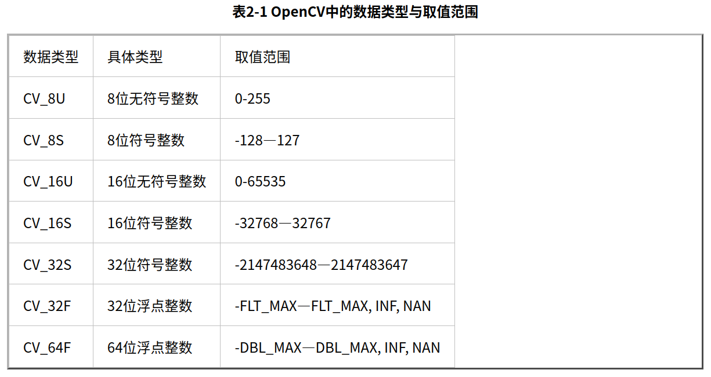

仅有数据类型是不够的，还需要定义图像数据的通道（Channel）数，例如灰度图像数据是单通道数据，彩色图像数据是3通道或者4通道数据。因此针对这个情况，OpenCV还定义了通道数标识，C1、C2、C3、C4分别表示单通道、双通道、3通道和4通道。每一种数据类型都存在多个通道的情况，所以将数据类型与通道数表示结合便得到了OpenCV中对图像数据类型的完整定义，例如CV_8UC1表示的就是8位单通道数据，用于表示8位灰度图，而CV_8UC3表示的是8位3通道数据，用于表示8位彩色图

```c++
//通过OpenCV数据类型创建Mat类
cv::Mat a(640,480,CV_8UC3) //创建一个640*480的3通道矩阵用于存放彩色图像
cv::Mat a(3,3,CV_8UC1) //创建一个3*3的8位无符号整数的单通道矩阵
cv::Mat a(3,3,CV_8U) //创建单通道矩阵C1标识可以省略
```

**数据结构**

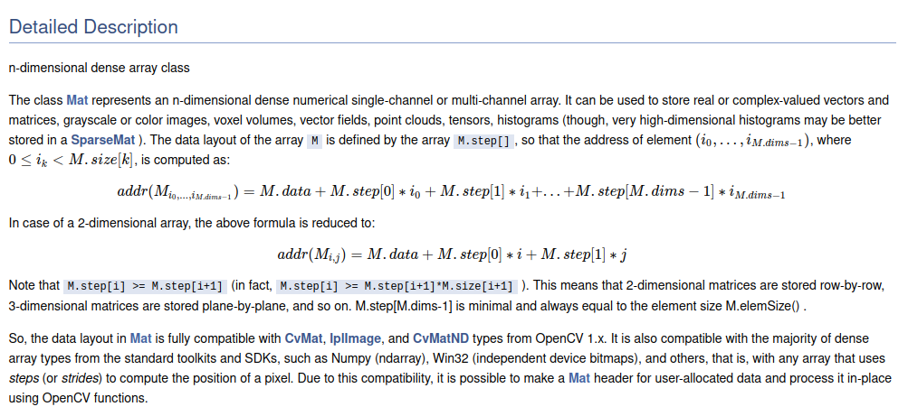

## at函数

**at()函数**

对于单通道图像"picture1"，**picture1.at<uchar>(i,j)**就表示在第i行第j列的像素值。

对于多通道图像如RGB图像"picture2"，可以用**picture2.at<Vec3b>(i,j)[c]**来表示某个通道中在(i,j)位置的像素值。

​	1）上面的==uchar、Vec3b表示图像元素的类型==。

​	2）==(i,j)==当然就是指像素点的位置，表示第i行第j列。

​	3）==[c]==表示的是==通道==，对于RGB图像而言，==c取0就是B分量；c取1就是G分量；c取2就是R分量==（要注意在OpenCV中是按BGR的顺序表示的）。

==Mat类中的at方法作用：用于获取图像矩阵某点的值或改变某点的值。==

对于单通道图像的使用方法：

           image.at<uchar>(i,j) = 255;

对于RGB三通道图像的使用方法：

           image.at<Vec3b>(i,j)[0] =  255;
    
           image.at<Vec3b>(i,j)[1] =  255;
    
           image.at<Vec3b>(i,j)[2] = 255;
————————————————
版权声明：本文为CSDN博主「xueluowutong」的原创文章，遵循CC 4.0 BY-SA版权协议，转载请附上原文出处链接及本声明。
原文链接：https://blog.csdn.net/xueluowutong/article/details/80922881

官方说明

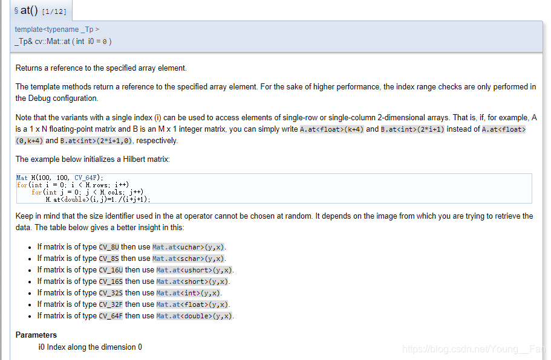

注意：

我们有时候会遇到这种情况

    带有单个索引(i)的变量可用于访问单行或单列二维数组的元素。也就是说，如果，例如，A是一个1 x N的浮点矩阵，B是一个M x 1的整数矩阵，你可以简单地写A在<float>(k+4)处和B在<int>(2*i+1)处，而不是A在<float>(0,k+4)处和B在<int>(2*i+1,0)处。


**#示例代码1 op.cpp**

```
#include <opencv2/opencv.hpp>
using namespace cv;
int main(int argc, char** argv)
{
	Mat picture(200, 200, CV_8UC1);/*创建图像picture，默认为纯黑色（即每个点的像素值为0），
								   大小为200 * 200，类型为CV_8UC1（是单通道图像）*/
	imshow("picture", picture);	//在“picture”窗口显示图像picture

​	//遍历picture的每个像素点，并将所有像素点的值修改为150
​	for (int i = 0; i < 200; i++)
​	{
​		for (int j = 0; j < 200; j++)
​			picture.at<uchar>(i, j) = 150;
​	}
​	imshow("dst", picture);//在“dst”窗口显示修改后的图像picture
​	waitKey(0);//等待用户按键
​	return 0;

}
```

获取结果如下

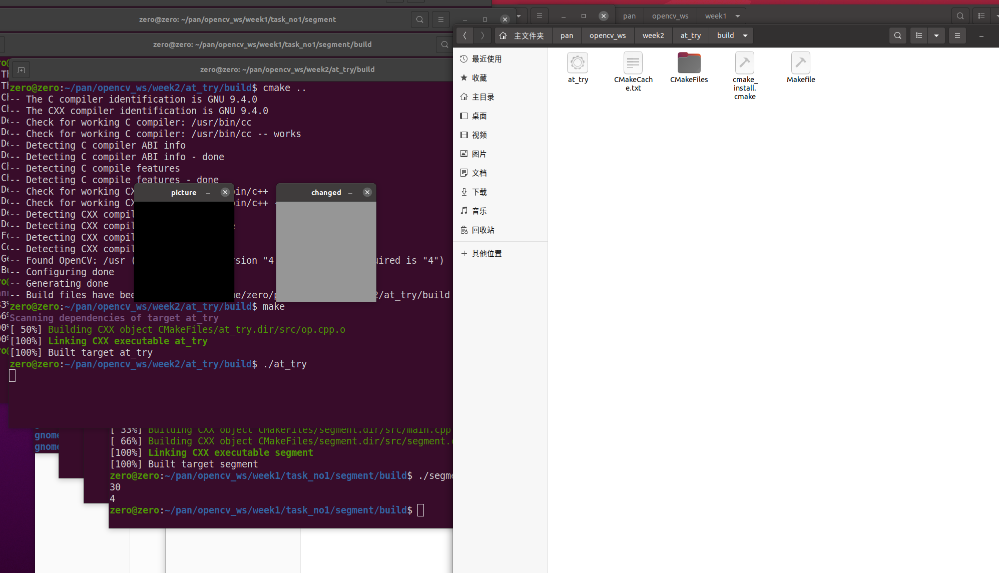

#示例代码2 op_color.cpp

```c++
//利用at函数处理rgb图像
#include <stdlib.h>
#include <opencv2/opencv.hpp>
using namespace cv;
 
int main(int argc, char** argv)
{
 
	Mat picture(200, 200, CV_8UC3);//新建一个三通道彩色图像，初始默认为纯黑色
	imshow("picture", picture);	
 
	//遍历picture的每个像素点，并将每个通道所有像素点的值修改为0~255中随机一个整数值
	for (int i = 0; i < 200; i++)
	{
		for (int j = 0; j < 200; j++)
		{
 
			picture.at<Vec3b>(i, j)[0] = rand() % 255;//B通道
			picture.at<Vec3b>(i, j)[1] = rand() % 255;//G通道
			picture.at<Vec3b>(i, j)[2] = rand() % 255;//R通道
		}
 
	}
 
	imshow("dst", picture);
	waitKey(0);
	return 0;
 
}
```

处理结果：

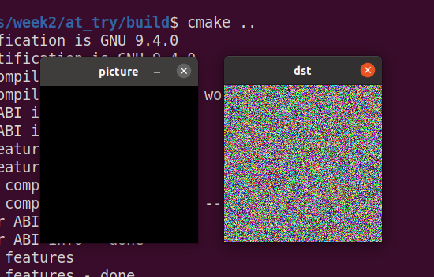


### 基础任务1

使用opencv的at方法，操作图像的每个像素点，并实现一幅图像从RGB色彩空间转换成HSV色彩空间或灰度图；

> 提示：主要是查找RGB到HSV/灰度图的公式，知乎或者csdn上有很多讲解 

数字图像处理——RGB与HSV图像互相转换原理https://blog.csdn.net/shandianfengfan/article/details/120600453 

Opencv颜色空间转换---BGR和HSV详解https://blog.csdn.net/weixin_42142612/article/details/100737896

**cvtColor函数**

```c++
	void cvtColor(InputArray src, OutputArray dst, int code, int dstCn=0)
```

src:原图像

dst:输出图像

code:转换模式，有CV_RGB2GRAY  CV_RGB2HSY  CV_BGR2HLS 等

dstCn:目标图像多通道设置，默认为0，即自动获取

**代码编写：**

```c++
#include <opencv2/opencv.hpp>
using namespace cv;

int main()
{
  //读取原图像
    Mat img = imread("/home/zero/pan/opencv_ws/week2/at_try/1.jpg", IMREAD_COLOR);
  	//cv.IMREAD_COLOR:默认参数，读入一副彩色图片，忽略alpha通道，可用1作为实参替代
    //cv.IMREAD_GRAYSCALE：读入灰度图片，可用0作为实参替代
	//cv.IMREAD_UNCHANGED：顾名思义，读入完整图片，包括alpha通道，可用-1作为实参替代
	/*PS：alpha通道，又称A通道，是一个8位的灰度通道，该通道用256级灰度来记录图像中的透明度复信息，定义透明、不透明和半透明区域，其中黑表示全透明，白表示不透明，灰表示半透明*/

 	//cvtColor函数，用于处理颜色空间的转换
    Mat img_hsv;
    cvtColor(img, img_hsv, COLOR_BGR2HSV);  //将RGB图像转换为HSV图像
 
    Mat img_rgb;
    cvtColor(img_hsv, img_rgb, COLOR_HSV2BGR);   //将HSV图像转换为RGB图像

    imshow("ori rgb", img);
    imshow("hsv", img_hsv);
    imshow("rgb", img_rgb);
    waitKey(0);
    return 0;
```

输出结果如下：

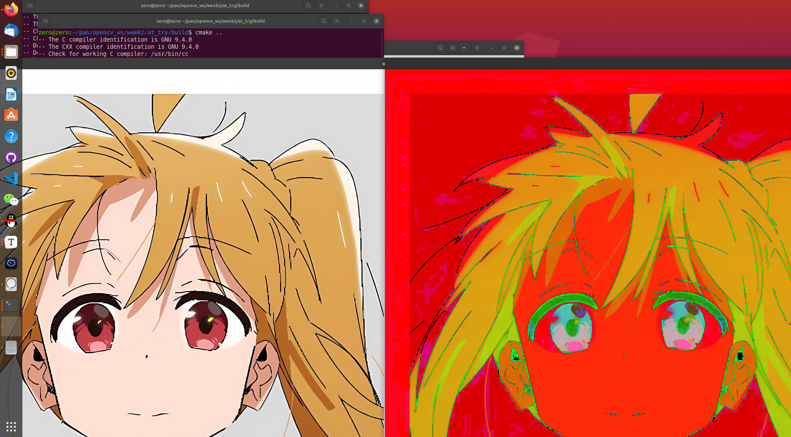

（出现了超级大号的虹夏）（下一步要学缩放）

### 基础任务二 缩放

https://docs.opencv.org/4.x/d4/d86/group__imgproc__filter.html#gaf9bba239dfca11654cb7f50f889fc2ff

**主要使用了高斯金字塔的向下采样`pyrDown`函数**

```C++
#include <opencv2/opencv.hpp>
using namespace cv;

int main()
{
    Mat srcImg = imread("../1.jpg", IMREAD_COLOR);
    Mat dstImg ;

    pyrDown(srcImg, dstImg, Size((srcImg.cols + 1) / 2 , (srcImg.rows + 1) / 2), BORDER_DEFAULT);

    imshow("src",srcImg);
    imshow("dst",dstImg);
    waitKey(0);
    return 0;
}
```

结果：

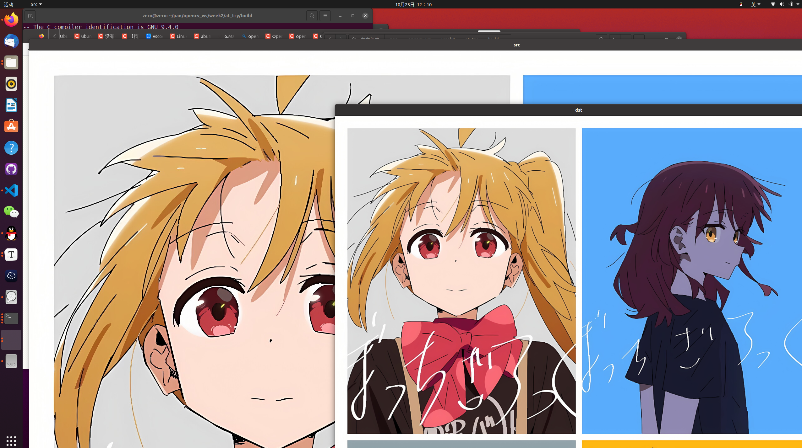

发现：貌似不能以任意比例放缩，需要进一步优化

优化：==**使用`resize`函数实现缩放**==

```c++
#include <opencv2/opencv.hpp>
using namespace cv;

int main()
{
    Mat srcImg = imread("../1.jpg", IMREAD_COLOR);
    Mat dstImg ;

    resize(srcImg,dstImg,Size(srcImg.cols / 4,srcImg.rows / 4),INTER_AREA);

    imshow("src",srcImg);
    imshow("dst",dstImg);
    waitKey(0);
    return 0;
}
```

最后终于是实现了結束〔けっそく〕的四合照啦！！！

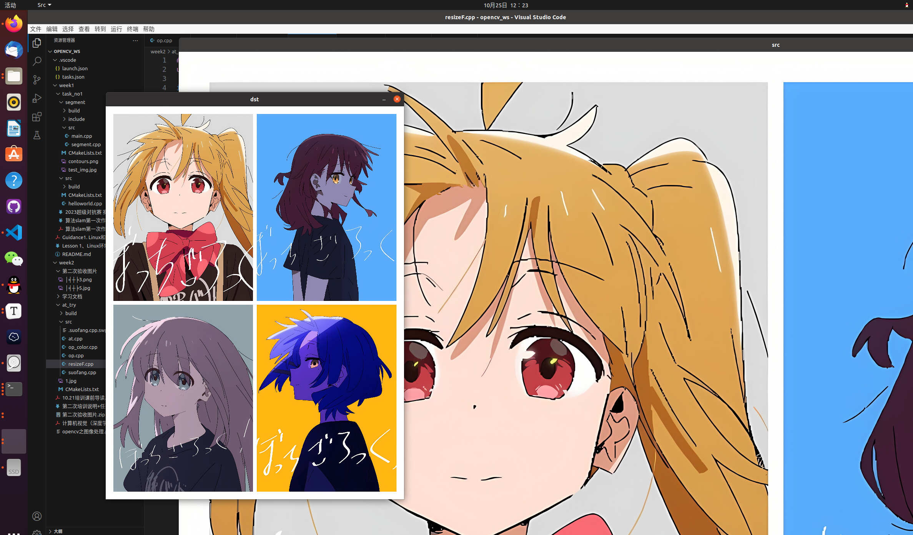


## 基础任务三 车牌识别

对平面正放车牌进行识别

STEP

* 1.获得图片灰度图
  * 导入图片，并使用函数转换
    * cvtColor()
* 2.提取轮廓，用Sobel算子提取y方向
  * 获取y梯度并进行y方向变换
    * Sobel()
    * convertScaleAbs()
* 3.阈值处理，自适应二值化
  * 将图片进行二值化变换，得到二值图
    * threshold()
* 4.闭运算处理，图像区域化
  * 定义kernel，用于区域化识别元素
    * getStructuringElement()
  * 定义close，进行闭区域运算
    * morphologyEx()
* 5.腐蚀+膨胀
  * erode dilate
* 6.获取外轮廓
  * contours, hierarchy
    * findContours()
    * drawContours()

* 7.截取车牌
  * 对外轮廓区域进行筛选识别，进而提取

```c++
#include <opencv2/opencv.hpp>
#include <iostream>
#include <vector>
using namespace cv;
using namespace std;

int main()
{
    //1.获得图片灰度图
    Mat img = imread("../pictures/3.png", IMREAD_COLOR); //读取图片
    Mat img_gray;
    cvtColor(img, img_gray,COLOR_RGB2GRAY); //转换BGR图片为灰度图
    //imshow("gray", img_gray); //展示灰度图

    //2.提取轮廓，用Sobel算子提取y方向
    Mat y_grad;
    Sobel(img_gray, y_grad, CV_16S, 0, 1, 3);
    convertScaleAbs(y_grad, y_grad);
    //imshow("y_grad", y_grad);

    //3.阈值处理,自适应二值化
    Mat binary;
    threshold(img_gray, binary, 127, 255, THRESH_OTSU);
    //imshow("binary", binary);

    //4.闭运算处理，图像区域化，便于找到车牌区域，进而得到轮廓
    Mat kernel = getStructuringElement(MORPH_RECT, Size(20,6));
    Mat close;
    morphologyEx(binary, close, MORPH_CLOSE, kernel);
    //imshow("close", close);

    //5.腐蚀/膨胀 去噪点得到车牌区域
    //横向 腐蚀+膨胀 
    Mat erodeX, dilateX;
    morphologyEx(close, erodeX, MORPH_ERODE, kernel);
    morphologyEx(erodeX, dilateX, MORPH_DILATE, kernel);
    //imshow("dilateX",dilateX);
    
    //纵向腐蚀+膨胀
    Mat erodeY, dilateY;
    morphologyEx(dilateX, dilateY, MORPH_DILATE, kernel);
    morphologyEx(dilateY, erodeY, MORPH_ERODE, kernel);
    //imshow("dilateY",dilateY);

    //6.获取外轮廓
    Mat img_f;
    Mat img_copy;
    img.copyTo(img_copy);

    vector<vector<cv::Point> > contours;
    vector<Vec4i> hierarchy;
    dilateY.copyTo(img_f);
    findContours(img_f, contours, hierarchy, RETR_EXTERNAL, CHAIN_APPROX_SIMPLE);
    drawContours(img_copy, contours, -1, Scalar(255, 0, 255), 5, 8, hierarchy); //填BGR数值的时候要加Scalar！！！
    imshow("img",img_copy); //一定要在原图像上画边框！！！
    waitKey(0);

    //7.截取车牌
    Mat license;
    for(int i = 0; i < contours.size(); i++)
    {
        Rect box = boundingRect(contours[i]);
        double ratio = double(box.width) / double(box.height) ;
        if(ratio > 3.65 && ratio < 3.7)
        {
            Rect rect = boundingRect(contours[i]);
            license = img(rect);//ROI
            imshow("License",license);
            //imwrite("License",license);
            waitKey(0);
        }
    }

    if(license.size)
    {
        imwrite("license.png",license);
    }

    return 0;
}


```

效果图：

1.y_grad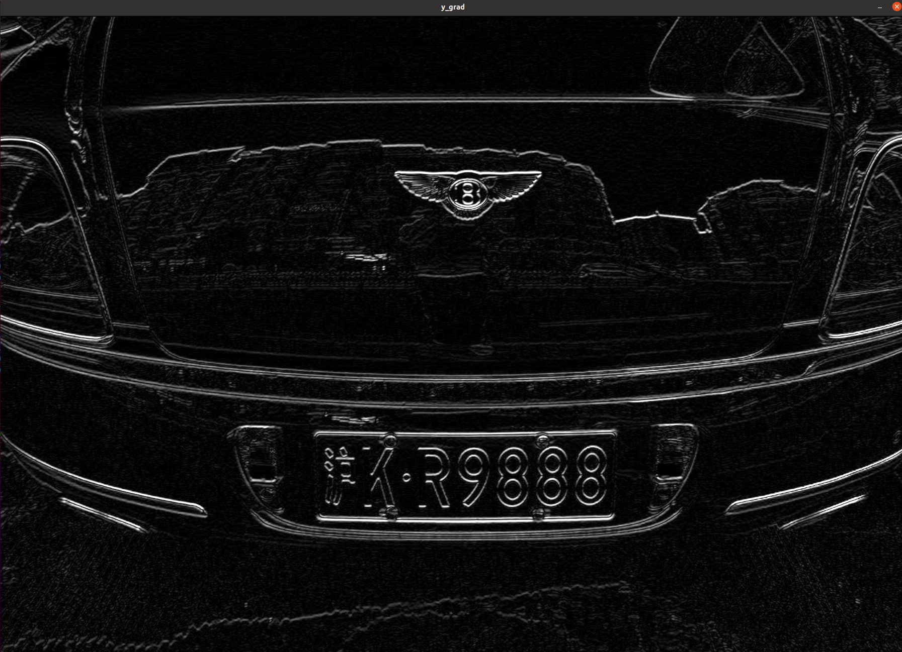


2.binary

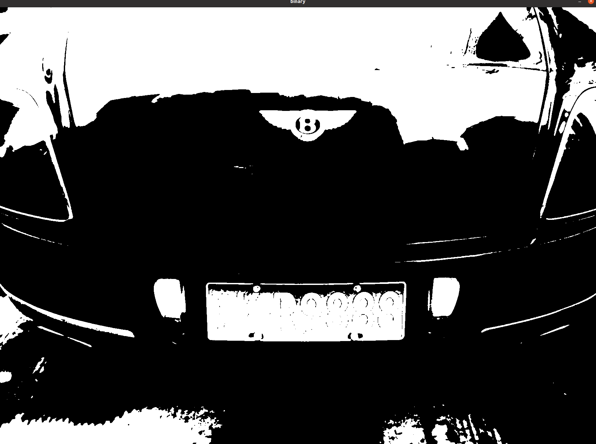

3.close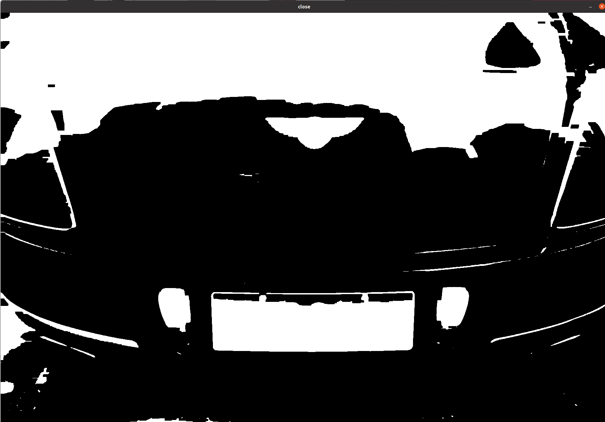

4.erode dilate

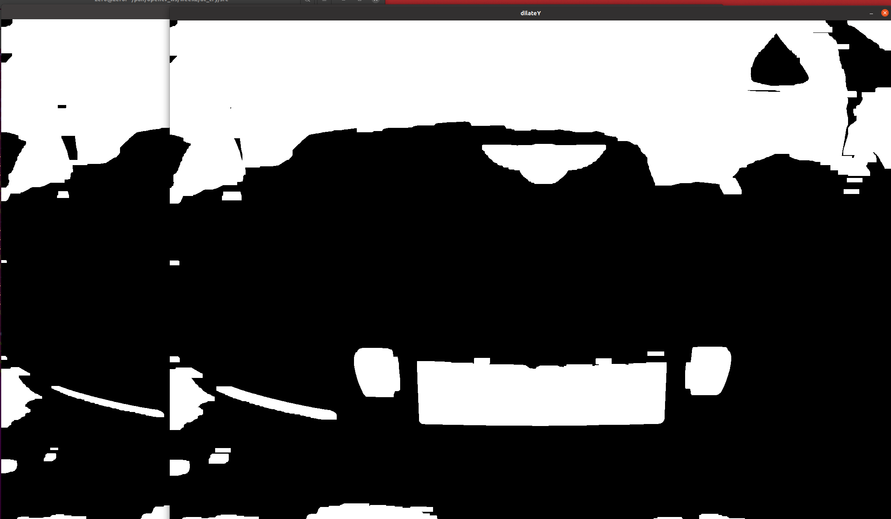


5.contours


6.license

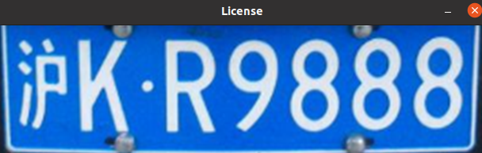


